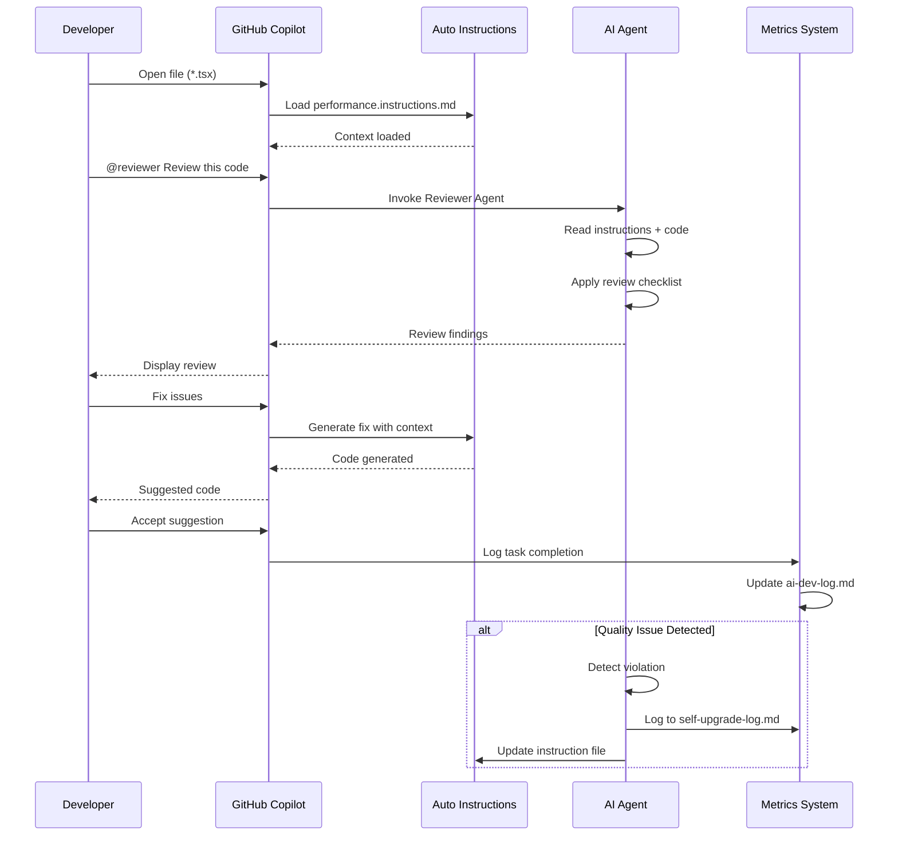

# Guide to Create AI Workflow for Engineering Teams

**A Production-Ready Blueprint for Building AI-Assisted Development Systems at Scale**

---

## Table of Contents

- [Executive Summary](#executive-summary)
- [Overview](#overview)
- [Phase 1: Foundation (Week 1-2)](#phase-1-foundation-week-1-2)
- [Phase 2: Core Infrastructure (Week 3-4)](#phase-2-core-infrastructure-week-3-4)
- [Phase 3: Agent Development (Week 5-6)](#phase-3-agent-development-week-5-6)
- [Phase 4: Metrics & Optimization (Week 7-8)](#phase-4-metrics--optimization-week-7-8)
- [Phase 5: Team Adoption (Week 9-12)](#phase-5-team-adoption-week-9-12)
- [Phase 6: Continuous Improvement](#phase-6-continuous-improvement)
- [Using AI Prompt Builder as Your Assistant](#using-ai-prompt-builder-as-your-assistant)
- [Leveraging AI Kits & Community Resources](#leveraging-ai-kits--community-resources)
- [Architecture Diagrams](#architecture-diagrams)
- [Best Practices for Large Teams](#best-practices-for-large-teams)
- [ROI Metrics & Reporting](#roi-metrics--reporting)
- [Troubleshooting & Common Pitfalls](#troubleshooting--common-pitfalls)
- [Case Study: Mokita Mobile](#case-study-mokita-mobile)
- [Appendix: Templates & Checklists](#appendix-templates--checklists)

---

## Executive Summary

This guide provides a **12-week blueprint** for implementing an enterprise-grade AI workflow system for engineering teams. Based on proven patterns from production systems, it covers:

- ✅ Automated context loading for GitHub Copilot
- ✅ Specialized AI agents for different development tasks
- ✅ Self-upgrading instruction system
- ✅ Productivity metrics and ROI tracking
- ✅ Team adoption strategies

**Expected Outcomes:**
- **75-78% time savings** on routine tasks
- **Consistent code quality** (85%+ compliance)
- **Faster onboarding** (30-50% reduction in ramp-up time)
- **Measurable ROI** within 3 months

---

## Overview

### What is an AI Workflow System?

An AI Workflow System is a structured collection of instructions, agents, prompts, and tools that enable AI assistants (like GitHub Copilot) to:

1. **Understand your codebase** automatically
2. **Follow project conventions** consistently
3. **Perform complex tasks** with minimal guidance
4. **Learn from mistakes** through self-upgrade
5. **Track productivity** with measurable metrics

### Why Your Team Needs This

| Problem | Without AI Workflow | With AI Workflow |
|---------|-------------------|------------------|
| **Onboarding** | 2-3 months to productivity | 1-2 weeks to basic productivity |
| **Code consistency** | Manual reviews catch 60% | Automated enforcement catches 95% |
| **Technical debt** | Grows uncontrolled | Prevented at generation time |
| **Knowledge retention** | Lost when developers leave | Codified in instructions |
| **Productivity** | Linear scaling with headcount | AI multiplies output 2-4x |

### Architecture at a Glance

```
AI Workflow System
├── Auto-Active Instructions (Always On)
│   └── Loaded by file pattern → Enforces standards automatically
├── Manual Tools (On Demand)
│   ├── Agents → Complex multi-step tasks
│   ├── Prompts → Template-based tasks
│   └── Skills → Knowledge documents
├── Metrics & Learning
│   ├── Productivity tracking
│   └── Self-upgrade logs
└── Team Integration
    ├── Documentation
    ├── Training materials
    └── Review processes
```

---

## Phase 1: Foundation (Week 1-2)

### Goal
Establish project conventions and baseline documentation.

### Pre-Work (Optional but Recommended)

Before diving into Phase 1, spend 1-2 days exploring existing AI kits and community resources. This can save significant time in later phases.

**Quick Exploration (Day 0):**
- [ ] Browse `awesome-copilot` repository
- [ ] Explore `spec-kits` for specification templates
- [ ] Check `oh-my-opencode` for workflow examples
- [ ] Bookmark 3-5 resources relevant to your tech stack
- [ ] Join 1-2 AI workflow communities (Discord/Slack)

**Why this matters**: You'll discover proven patterns and avoid reinventing the wheel. See [Leveraging AI Kits & Community Resources](#leveraging-ai-kits--community-resources) for detailed guidance.

### Steps

#### 1.1 Audit Your Codebase (Day 1-2)

**Objective**: Understand current state before automation.

**Tasks:**
- [ ] Document your tech stack (frameworks, libraries, versions)
- [ ] Identify architecture patterns (MVC, MVVM, feature-based, etc.)
- [ ] List coding conventions (naming, folder structure, etc.)
- [ ] Catalog common anti-patterns and technical debt
- [ ] Document build/deployment process

**Deliverable**: `CODEBASE_AUDIT.md`

```markdown
## Tech Stack
- Frontend: React Native 0.71
- State: Redux + React Query
- Navigation: React Navigation v6
- TypeScript: v4.8

## Architecture Patterns
- Feature-based folder structure
- Service layer for API calls
- Container/Component separation

## Conventions
- camelCase for folders
- PascalCase for components
- Functional components only (no class components)
...
```

#### 1.2 Define Core Principles (Day 3-4)

**Objective**: Establish non-negotiable rules for AI to follow.

**Use Prompt Builder:**

```
@prompt-builder

Based on this codebase audit:
#file:CODEBASE_AUDIT.md

Generate a set of 10-15 core development principles that should NEVER be violated.
Format as a checklist with explanations.
```

**Deliverable**: `.github/CORE_PRINCIPLES.md`

Example principles:
- ✅ All new code must be TypeScript (no `.js` files)
- ✅ No `any` types without explicit justification
- ✅ All components must be functional (no class components)
- ✅ State management follows single pattern (Redux OR Jotai, not both)

#### 1.3 Set Up Directory Structure (Day 5)

Create the `.github/` AI workflow directory:

```bash
mkdir -p .github/{instructions,agents,prompts,skills,metrics,references}
touch .github/copilot-instructions.md
touch .github/README.md
touch .github/metrics/ai-dev-log.md
touch .github/metrics/self-upgrade-log.md
```

**Deliverable**: Folder structure ready for population.

---

## Phase 2: Core Infrastructure (Week 3-4)

### Goal
Build auto-active instruction files that enforce conventions automatically.

### Steps

#### 2.1 Create Master Instructions File (Week 3, Day 1-2)

**File**: `.github/copilot-instructions.md`

This is the **always-on** context file. Use Prompt Builder to generate:

```
@prompt-builder

Generate a comprehensive copilot-instructions.md file for my project.

Context:
- Tech stack: [from CODEBASE_AUDIT.md]
- Core principles: #file:.github/CORE_PRINCIPLES.md
- Architecture: Feature-based, see folder structure below

Structure needed:
1. Project overview (2-3 paragraphs)
2. Tech stack section
3. Architecture & file organization
4. Critical development patterns
5. Path aliases and imports
6. Common gotchas & tips
7. Anti-patterns (what NOT to do)

Tone: Technical, concise, authoritative.
Length: ~500-800 lines.
```

**Key Sections to Include:**

```markdown
# Project Name — AI Development Context

## Project Overview
[What the project does, who uses it, scale/metrics]

## Tech Stack
- Framework: ...
- State Management: ...
- Styling: ...

## Architecture
[Folder structure, dependency flow, layers]

## Critical Development Patterns
### Pattern 1: Data Fetching
- Use [specific pattern]
- Never [anti-pattern]

### Pattern 2: Component Structure
...

## Path Aliases
- `@components` → src/components
- `@utils` → src/utils

## Anti-Patterns (NEVER do these)
- ❌ Don't use class components
- ❌ Don't import from legacy paths
...
```

#### 2.2 Create Pattern-Specific Instructions (Week 3, Day 3-5)

Generate **auto-active** instruction files that trigger based on file patterns.

**Example 1: Performance Instructions**

```
@prompt-builder

Create a performance optimization instruction file for React Native.

Trigger pattern: *.ts, *.tsx files
Focus areas:
- FlatList optimization
- React.memo usage
- Image handling
- StyleSheet best practices
- Re-render prevention

Include:
- Must-have optimizations checklist
- Common performance mistakes
- Code examples (good vs bad)
```

Save as: `.github/instructions/performance.instructions.md`

**Example 2: Testing Instructions**

```
@prompt-builder

Create a testing standards instruction file.

Trigger pattern: *.test.ts, *.test.tsx
Testing framework: Jest + React Testing Library
Coverage expectations: 80% for business logic

Include:
- Test file structure template
- Mocking patterns
- What to test vs what to skip
- Anti-patterns
```

Save as: `.github/instructions/testing.instructions.md`

**Example 3: v3 Standards (for migration scenarios)**

If you have legacy code and a new architecture:

```
@prompt-builder

Create instructions for our v3 architecture standards.

Trigger pattern: src/v3/**
Context: We're migrating from v2 (class components, Redux) to v3 (functional, React Query)

Rules for v3:
- Functional components only
- React Query for server state
- Jotai for client state
- No imports from v2 paths

Include:
- Folder structure requirements
- Naming conventions
- Import rules
- Migration checklist
```

Save as: `.github/instructions/v3-standards.instructions.md`

#### 2.3 Set Up Index File (Week 4, Day 1)

**File**: `.github/instructions/index.md`

Document all instruction files and their activation patterns:

```markdown
# AI Workflow Instructions Index

## Auto-Active Instructions

| File | Active When | Purpose |
|------|-------------|---------|
| copilot-instructions.md | Always | Core project context |
| performance.instructions.md | `*.ts`, `*.tsx` | Performance optimization |
| testing.instructions.md | `*.test.ts`, `*.test.tsx` | Testing standards |
| v3-standards.instructions.md | `src/v3/**` | v3 architecture rules |

## How It Works

When you open a file matching the pattern, GitHub Copilot automatically loads
the corresponding instruction file as context.

## Adding New Instructions

1. Create `.instructions.md` file in this folder
2. Add `applyTo` frontmatter with file pattern
3. Update this index
```

---

## Phase 3: Agent Development (Week 5-6)

### Goal
Create specialized AI agents for complex, multi-step tasks.

### Steps

#### 3.1 Identify Agent Needs (Week 5, Day 1)

Analyze your development workflow. Common agents needed:

| Agent Type | Use Case | Priority |
|-----------|----------|----------|
| **Planner** | Feature planning before coding | High |
| **Reviewer** | Code review automation | High |
| **Builder** | Generate feature scaffolds | Medium |
| **Migrator** | Legacy → new architecture | Medium (if applicable) |
| **Tester** | Generate test suites | Medium |
| **Writer** | Generate documentation | Low |

#### 3.2 Create Super Agent (Week 5, Day 2-4)

The **Super Agent** is your master agent with multiple modes.

```
@prompt-builder

Create a master "Super Agent" for my project with these modes:

Mode 1 (build): New feature development
Mode 2 (review): Code review
Mode 3 (test): Test generation
Mode 4 (migrate): [if applicable] Legacy migration
Mode 5 (debug): Bug fixing workflow

Project context:
#file:.github/copilot-instructions.md

Include:
- Mode selection logic
- Workflow for each mode
- Tools access (all available tools)
- Output format standards
```

Save as: `.github/agents/super-agent.agent.md`

**Template Structure:**

```markdown
---
description: Master development agent with 5 operating modes
name: Super Agent
tools: [all tools listed]
---

# Super Agent

## Context Awareness
[Mental model of your architecture]

## Operating Modes

### Mode 1: Build Mode
**Trigger**: "create", "build", "implement"
**Workflow**:
1. Discovery (search similar features)
2. Plan (generate structure)
3. Implement (create files)
4. Test (generate tests)
5. Document (update docs)

### Mode 2: Review Mode
[Review workflow]

...
```

#### 3.3 Create Specialized Agents (Week 5-6)

**Planner Agent:**

```
@prompt-builder

Create a strategic planner agent.

Purpose: Generate implementation plans before coding
Output format: Markdown with phases, task tables, risks
Tools: search, view, codebase analysis

Include sections:
- Requirements analysis
- Architecture impact assessment
- Phase breakdown
- File structure
- Risks & mitigations
```

Save as: `.github/agents/planner.agent.md`

**Reviewer Agent:**

```
@prompt-builder

Create a code reviewer agent with principal engineer perspective.

Review checklist:
#file:.github/CORE_PRINCIPLES.md

Focus areas:
- Architecture compliance
- Performance
- Security
- Type safety
- Testing coverage

Output format: Structured review with severity levels (blocking, warning, suggestion)
```

Save as: `.github/agents/reviewer.agent.md`

**Builder Agent (if needed):**

```
@prompt-builder

Create a feature builder agent.

Input: Feature requirements
Output: Complete feature scaffold with:
- Service layer files
- Model/type definitions
- Hooks
- Components
- Tests
- Documentation

Follow structure from:
#file:.github/copilot-instructions.md
```

Save as: `.github/agents/builder.agent.md`

#### 3.4 Test Agents (Week 6, Day 5)

Create a test plan:

```markdown
## Agent Testing Checklist

### Super Agent
- [ ] Mode detection works correctly
- [ ] Build mode generates proper structure
- [ ] Review mode catches violations
- [ ] Test mode generates valid tests

### Planner Agent
- [ ] Plan includes all required sections
- [ ] Risks are identified
- [ ] File structure is accurate

### Reviewer Agent
- [ ] Catches architecture violations
- [ ] Performance issues flagged
- [ ] Security concerns raised
```

---

## Phase 4: Metrics & Optimization (Week 7-8)

### Goal
Implement tracking and self-improvement mechanisms.

### Steps

#### 4.1 Set Up Metrics Tracking (Week 7, Day 1-2)

**File**: `.github/metrics/ai-dev-log.md`

```markdown
# AI Development Metrics

## Summary Dashboard

| Metric | Value |
|--------|-------|
| Total Tasks Completed | 0 |
| Total Files Created by AI | 0 |
| Total LOC Generated | 0 |
| Total LOC Human-Edited | 0 |
| AI Code Ratio | 0% |
| Total Estimated Time Saved | 0h |
| Average Quality Score | 0% |

## Entry Log

<!-- Entries will be appended here -->
```

#### 4.2 Create Task Summary Protocol (Week 7, Day 3)

Add to **all agents** a task summary section:

```markdown
## Task Summary Protocol

After completing ANY implementation task, provide:

```markdown
## Task Summary

**Task**: [description]
**Type**: [feature|migration|refactor|bugfix|test]
**Status**: [completed|partial|blocked]

### What Was Done
- [List of changes]

### Files Changed
| File | Action | Description |
|------|--------|-------------|
| [path] | CREATE/MODIFY/DELETE | [what changed] |

### Quality Checklist
- [ ] Conventions followed
- [ ] TypeScript strict
- [ ] Performance optimized
- [ ] Tests added

### AI Metrics
- Lines of code generated: [number]
- Files created: [number]
- Estimated time saved: [estimate]
```

This summary MUST be appended to `.github/metrics/ai-dev-log.md`.
```

#### 4.3 Implement Self-Upgrade System (Week 7, Day 4-5)

**File**: `.github/metrics/self-upgrade-log.md`

```markdown
# Self-Upgrade Log

This log tracks AI improvements to its own instructions.

## How It Works

When AI detects incorrect output:
1. Fix the immediate issue
2. Update relevant instruction file
3. Log the upgrade here

## Upgrade Entries

<!-- Entries will be added here -->
```

**Add to all agents:**

```markdown
## Self-Upgrade Protocol

When you produce output that violates project standards:

1. **Detect**: Identify what went wrong
2. **Correct**: Fix the immediate issue
3. **Upgrade**: Update the relevant .github/ file:
   - Wrong conventions → update instructions
   - Wrong pattern → update skill
   - Wrong behavior → update agent
4. **Log**: Record in self-upgrade-log.md:

```markdown
### [YYYY-MM-DD] Upgrade: [Title]
- **Trigger**: [What went wrong]
- **Root Cause**: [Why]
- **File Updated**: [Which file]
- **Change**: [What was added/fixed]
```
```

#### 4.4 Create Metrics Dashboard Script (Week 8, Optional)

```javascript
// scripts/generate-ai-metrics-report.js
const fs = require('fs');
const path = require('path');

const logPath = '.github/metrics/ai-dev-log.md';
const logContent = fs.readFileSync(logPath, 'utf-8');

// Parse entries and generate monthly report
// Output: ai-metrics-report-YYYY-MM.md
```

---

## Phase 5: Team Adoption (Week 9-12)

### Goal
Train team, gather feedback, iterate.

### Steps

#### 5.1 Create Team Documentation (Week 9)

**File**: `.github/README.md`

Use this guide as template structure:

```
@prompt-builder

Generate a comprehensive README for our AI workflow system.

Audience: Engineers joining the project
Structure:
1. How it works (auto vs manual)
2. 10-15 use cases with examples
3. Tips & tricks
4. FAQ

Tone: Friendly, practical, example-heavy
Reference: #file:.github/copilot-instructions.md
```

Include:
- **Quick start** (5 minutes to first win)
- **Use cases** (new feature, review, testing, etc.)
- **Command reference** (all agents + prompts)
- **Tips & tricks**
- **FAQ**

#### 5.2 Pilot Program (Week 10)

**Select 3-5 early adopters:**
- Mix of senior and mid-level engineers
- Different feature teams
- Willing to provide feedback

**Pilot tasks:**
- [ ] Build new feature using agents
- [ ] Review PR using reviewer agent
- [ ] Generate tests using test prompt
- [ ] Migrate legacy code (if applicable)

**Gather feedback:**
```markdown
## Pilot Feedback Form

### What worked well?
- [feedback]

### What was confusing?
- [feedback]

### What's missing?
- [feedback]

### Suggestions?
- [feedback]
```

#### 5.3 Iterate Based on Feedback (Week 11)

Common feedback and fixes:

| Feedback | Fix |
|----------|-----|
| "Too verbose" | Add token efficiency guidelines to agents |
| "Doesn't catch X pattern" | Add to instructions/checklist |
| "Agent hallucinated Y" | Add anti-hallucination rules |
| "Missing Z use case" | Create new prompt or agent |

Update:
- [ ] Instruction files
- [ ] Agent behaviors
- [ ] Documentation examples
- [ ] FAQ section

#### 5.4 Full Team Rollout (Week 12)

**Kickoff meeting:**
- Demo 3-5 common workflows
- Show time savings metrics from pilot
- Q&A session

**Resources:**
- [ ] Slack channel for AI workflow questions
- [ ] Office hours (2x/week for first month)
- [ ] Video tutorials (optional)

**Adoption tracking:**
```markdown
## Adoption Metrics

Week 1:
- % of team using AI agents: 0%
- Tasks completed with AI: 0

Week 4:
- % of team using AI agents: 50%
- Tasks completed with AI: 15

Week 8:
- % of team using AI agents: 80%
- Tasks completed with AI: 60
```

---

## Phase 6: Continuous Improvement

### Ongoing Activities

#### Monthly Review

**Metrics to review:**
- Total tasks completed
- Time saved
- Quality scores
- Adoption rate

**Questions:**
- Which agents are most/least used?
- What errors occur frequently?
- What new patterns emerged?

#### Quarterly Upgrade

**Tasks:**
- [ ] Audit self-upgrade log
- [ ] Consolidate repeated patterns into instructions
- [ ] Archive outdated agents
- [ ] Create new agents for emerging needs

#### Feedback Loop


---

## Using AI Prompt Builder as Your Assistant

The **Prompt Builder** agent helps you create and improve all AI workflow components.

### Setup Prompt Builder

```
@prompt-builder

I'm building an AI workflow system for my engineering team.
I'll be asking you to help generate:
- Instruction files
- Agent definitions
- Prompts
- Skills documents

Context about my project:
#file:.github/copilot-instructions.md

Please help me create high-quality, production-ready AI workflow components.
```

### Common Prompt Builder Tasks

#### 1. Generate New Instruction File

```
@prompt-builder

Create an instruction file for [TOPIC].

Trigger pattern: [file pattern]
Focus areas: [list]
Include: [checklist items, examples, anti-patterns]

Project context:
#file:.github/copilot-instructions.md
```

#### 2. Improve Existing Agent

```
@prompt-builder

Review and improve this agent:
#file:.github/agents/reviewer.agent.md

Issues:
- Too verbose (reduce token usage)
- Missing security checks
- Output format inconsistent

Update the agent definition.
```

#### 3. Create New Prompt Template

```
@prompt-builder

Create a prompt template for generating [TASK].

Input: [what user provides]
Output: [expected result]
Format: [structure]

Include:
- Clear instructions
- Examples
- Success criteria
```

#### 4. Audit Entire Workflow

```
@prompt-builder

Audit my AI workflow system for:
- Conflicting instructions
- Missing coverage areas
- Outdated patterns
- Gaps in documentation

Files to review:
#file:.github/instructions/
#file:.github/agents/

Provide recommendations.
```

---

## Leveraging AI Kits & Community Resources

Before building everything from scratch, explore existing AI workflow kits and resources from the open-source community. This can accelerate your implementation by 40-60% and provide battle-tested patterns.

### Why Explore AI Kits?

| Benefit | Impact |
|---------|--------|
| **Faster Start** | Pre-built templates save 20-40 hours of initial setup |
| **Proven Patterns** | Learn from production implementations |
| **Avoid Pitfalls** | Discover what works/doesn't from community experience |
| **Stay Updated** | Track latest AI tooling innovations |
| **Adapt & Customize** | Start with templates, customize for your needs |

### Essential AI Kit Repositories

#### 1. **awesome-copilot**
**Repository**: `github.com/jondot/awesome-copilot` (or similar awesome lists)

**What it contains:**
- Curated list of GitHub Copilot extensions
- Community-built agents and prompts
- Integration tools and plugins
- Best practices documentation

**How to use:**
```bash
# Clone and explore
git clone https://github.com/jondot/awesome-copilot
cd awesome-copilot

# Review sections relevant to your stack
- Look for: Prompt libraries, Agent templates, Workflow examples
```

**What to adopt:**
- ✅ Agent architectures that match your use case
- ✅ Prompt engineering patterns
- ✅ Integration scripts for your IDE
- ❌ Don't copy blindly — adapt to your conventions

#### 2. **spec-kits** (Specification Kits)
**Purpose**: Structured specifications for AI-generated code

**What it contains:**
- API specification templates
- Architecture decision records (ADR) for AI workflows
- Code quality specifications
- Testing requirement templates

**How to use:**
```
@prompt-builder

Review these spec-kits examples:
#file:spec-kits/examples/api-spec-template.md

Adapt them for our project with these modifications:
- Our tech stack: [your stack]
- Our conventions: #file:.github/CORE_PRINCIPLES.md

Generate customized spec templates.
```

**What to adopt:**
- ✅ Specification structures for consistent AI output
- ✅ Quality gates and acceptance criteria
- ✅ Documentation templates

#### 3. **oh-my-opencode** (or similar workflow collections)
**Purpose**: Ready-to-use AI workflow configurations

**What it contains:**
- Pre-configured Copilot instruction files
- Agent collections for common tasks
- Workflow automation scripts
- Integration with popular frameworks

**How to use:**
1. Browse available workflows for your framework
2. Test in a branch before adopting
3. Customize naming and conventions
4. Integrate with your existing `.github/` structure

**Example integration:**
```bash
# Clone and explore
git clone https://github.com/community/oh-my-opencode

# Copy relevant configs
cp oh-my-opencode/react-native/performance.instructions.md .github/instructions/
cp oh-my-opencode/agents/reviewer-agent.md .github/agents/

# Customize for your project
# Update imports, naming conventions, examples
```

#### 4. **GitHub Copilot Extensions Marketplace**
**Where**: GitHub marketplace or VS Code extensions

**What to explore:**
- Copilot Chat extensions for specific frameworks
- Code review automation tools
- Documentation generators
- Test generation plugins

**Recommended extensions:**
- **Copilot Labs**: Experimental features and agent builders
- **Copilot for CLI**: Command-line assistance
- **Cursor AI**: Alternative IDE with built-in AI workflows

#### 5. **Community Prompt Libraries**

**Sources:**
- `github.com/f/awesome-chatgpt-prompts`
- `github.com/promptslab/Awesome-Prompt-Engineering`
- `learnprompting.org`

**What to extract:**
- System prompts for consistent AI behavior
- Chain-of-thought patterns for complex tasks
- Anti-hallucination techniques
- Token optimization strategies

**How to integrate:**
```
@prompt-builder

Based on these community prompt patterns:
[paste relevant pattern from awesome-prompts]

Create an agent for our codebase that:
- Follows our conventions: #file:.github/copilot-instructions.md
- Uses this prompt pattern for [specific task]
- Outputs in our standard format
```

### Exploration Workflow

**Week 0 (Before Phase 1):** Research & Discovery

```markdown
## AI Kits Exploration Checklist

### Day 1: Survey Landscape
- [ ] Browse awesome-copilot for relevant tools
- [ ] Star repos for later deep-dive
- [ ] Join Discord/Slack communities
- [ ] Bookmark documentation sites

### Day 2: Evaluate Fit
- [ ] Compare 3-5 agent templates to your needs
- [ ] Test sample instructions with your codebase
- [ ] Document what works/doesn't work
- [ ] Identify gaps to fill custom

### Day 3: Extract Patterns
- [ ] Copy 2-3 best-fit templates
- [ ] Adapt naming to your conventions
- [ ] Remove framework-specific code
- [ ] Add your project context

### Day 4: Integrate & Test
- [ ] Place adapted files in .github/
- [ ] Test with real coding tasks
- [ ] Measure quality of output
- [ ] Document customizations made

### Day 5: Document Learnings
- [ ] Create .github/EXTERNAL_RESOURCES.md
- [ ] List sources and what was adopted
- [ ] Note customizations and why
- [ ] Share findings with team
```

**Deliverable**: `.github/EXTERNAL_RESOURCES.md`

```markdown
# External AI Resources Used

This document tracks external AI kits, templates, and resources adopted for our workflow.

## Resources Adopted

### awesome-copilot
- **Source**: https://github.com/jondot/awesome-copilot
- **Adopted**: Reviewer agent structure
- **Customizations**: 
  - Changed from generic JS to React Native focus
  - Added white-label multi-brand context
  - Integrated with our v3 migration standards
- **Date**: 2026-02-10

### spec-kits
- **Source**: https://github.com/example/spec-kits
- **Adopted**: API specification template
- **Customizations**:
  - Aligned with our service layer pattern
  - Added TypeScript strict mode requirements
- **Date**: 2026-02-11

## Community Prompts Integrated
[List specific prompts and where they're used]

## Rejected Resources & Why
- **Resource X**: Too generic, didn't fit React Native
- **Resource Y**: Outdated patterns (class components)

## Future Exploration
- [ ] Explore Cursor AI for team trial
- [ ] Evaluate new Copilot Labs features
- [ ] Review quarterly for new community tools
```

### Best Practices for Adopting External Resources

#### ✅ DO:
- **Test in isolation first**: Try external agents/prompts on sample tasks
- **Adapt, don't copy**: Customize to your conventions and context
- **Credit sources**: Document where patterns came from
- **Version control**: Track what changed from original
- **Iterate**: Start with 1-2 resources, expand gradually

#### ❌ DON'T:
- **Blindly copy-paste**: External templates won't match your codebase
- **Ignore licensing**: Check if commercial use is allowed
- **Skip testing**: Verify quality before team rollout
- **Forget to update**: External repos evolve — revisit quarterly
- **Adopt everything**: Focus on 2-3 high-impact resources

### Integration with This Guide

**How AI Kits fit into the 12-week plan:**

| Phase | How to Use AI Kits |
|-------|-------------------|
| **Phase 0 (Pre-work)** | Explore awesome-copilot, spec-kits; identify templates |
| **Phase 1 (Foundation)** | Adapt external core principles and audit checklists |
| **Phase 2 (Infrastructure)** | Use external instruction templates as starting point |
| **Phase 3 (Agents)** | Customize community agent architectures |
| **Phase 4 (Metrics)** | Adopt external metrics dashboards |
| **Phase 5 (Adoption)** | Share external success stories with team |
| **Phase 6 (Continuous)** | Monitor external repos for new patterns |

### Recommended Exploration Schedule

**Monthly:**
- Check awesome-copilot for new tools (1 hour)
- Review 1-2 new agent templates (2 hours)
- Test new Copilot features/extensions (1 hour)

**Quarterly:**
- Deep-dive on emerging AI workflow frameworks
- Evaluate if major external updates require refactor
- Contribute learnings back to community

### Contributing Back to Community

Once your workflow is mature, consider:

1. **Open-source your generic agents** (remove proprietary context)
2. **Write blog posts** about patterns that worked
3. **Submit PRs** to awesome-copilot with your learnings
4. **Create spec-kits** for your framework if not covered
5. **Present at conferences** or write case studies

**Example contribution:**
```markdown
# Contributing Our Reviewer Agent

Our React Native reviewer agent (sanitized version) contributed to:
- awesome-copilot: PR #123
- Includes: Performance checks, white-label patterns, v3 migration rules
- Unique value: Multi-brand architecture compliance

Community feedback helped us improve token efficiency by 35%.
```

### AI Kits Exploration Resources

**Documentation:**
- GitHub Copilot Docs: `docs.github.com/copilot`
- OpenAI Prompt Engineering Guide: `platform.openai.com/docs/guides/prompt-engineering`
- Awesome Prompts: `github.com/f/awesome-chatgpt-prompts`

**Communities:**
- GitHub Copilot Discord
- r/OpenAI and r/ChatGPT subreddits
- Dev.to AI tooling tag
- Twitter/X AI engineering community

**Tools:**
- Prompt Playground: Test prompts before integrating
- Token Counter: Optimize instruction file sizes
- Git Diff Analyzers: Track external template changes

---

## Architecture Diagrams

### System Architecture


### Workflow Lifecycle


### Agent Decision Flow


### Data Flow



---

## Best Practices for Large Teams

### 1. Governance

**Establish AI Workflow Owners:**
- **Primary Owner**: Responsible for system maintenance
- **Secondary Owners**: 2-3 senior engineers as backup
- **Working Group**: Representatives from each team (monthly meetings)

**Decision Making:**
```markdown
## AI Workflow RFC Process

1. Propose change in #ai-workflow Slack
2. Create RFC document (template below)
3. 1-week comment period
4. Working group reviews
5. Approve/Reject with reasoning
6. Implement if approved
```

### 2. Version Control

**Semantic Versioning for Instructions:**
```markdown
## Instruction File Versioning

v1.0.0 - Initial release
v1.1.0 - Added performance section
v1.2.0 - Added security checklist
v2.0.0 - Breaking: Changed folder structure
```

**Change Log:**
```markdown
# .github/CHANGELOG.md

## [2.0.0] - 2026-02-13
### Breaking Changes
- Renamed `builder.agent.md` to `super-agent.agent.md`
- Changed mode parameter syntax

### Added
- New security.instructions.md
- Migration guide for v2→v3

### Fixed
- Reviewer agent token usage reduced by 40%
```

### 3. Testing AI Workflow Changes

**Before deploying instruction updates:**

```markdown
## AI Workflow Test Plan

Test Case 1: Performance Instructions
- [ ] Open any .tsx file
- [ ] Verify performance.instructions.md loads
- [ ] Generate component with FlatList
- [ ] Confirm React.memo is added
- [ ] Confirm StyleSheet.create is used

Test Case 2: Reviewer Agent
- [ ] Invoke @reviewer on sample PR
- [ ] Verify catches class component (if present)
- [ ] Verify catches missing types
- [ ] Verify output format matches template

...
```

### 4. Multi-Team Coordination

**Shared vs Team-Specific:**

```
.github/
├── instructions/           # Shared across all teams
│   ├── copilot-instructions.md
│   └── performance.instructions.md
├── team-specific/          # Team customizations
│   ├── backend/
│   │   └── api-standards.instructions.md
│   ├── mobile/
│   │   └── mobile-perf.instructions.md
│   └── web/
│       └── accessibility.instructions.md
```

### 5. Conflict Resolution

**When teams disagree on conventions:**

```markdown
## Conflict Resolution Process

1. Document both approaches
2. Run pilot with each (2 weeks)
3. Measure:
   - Code quality (review comments)
   - Developer satisfaction (survey)
   - Productivity (task completion time)
4. Working group votes
5. Losing approach archived with reasoning
```

---

## ROI Metrics & Reporting

### Metrics to Track

#### Productivity Metrics

| Metric | How to Measure | Target |
|--------|----------------|--------|
| Time saved per task | Manual estimate - AI time | 60%+ |
| Tasks completed with AI | Count from ai-dev-log.md | 70%+ adoption |
| Code generated vs edited | LOC AI / (LOC AI + LOC human) | 85%+ |
| Average quality score | From review checklist | 85%+ |

#### Quality Metrics

| Metric | How to Measure | Target |
|--------|----------------|--------|
| Code review cycles | Before/after AI workflow | -30% |
| Production bugs | Before/after AI workflow | -20% |
| Convention violations | Caught by reviewer agent | 95%+ |
| Test coverage | From coverage reports | +15% |

#### Adoption Metrics

| Metric | How to Measure | Target |
|--------|----------------|--------|
| Active users | Weekly agent invocations | 80% of team |
| Agent usage frequency | Calls per developer per week | 10+ |
| Documentation views | .github/README.md traffic | 100% in month 1 |

### Monthly Report Template

```markdown
# AI Workflow Monthly Report — [Month Year]

## Executive Summary
- **Tasks Completed**: [number] (+X% vs last month)
- **Time Saved**: [hours] (~[days] of work)
- **Adoption Rate**: [%] ([number]/[total] developers)
- **Quality Score**: [%] average

## Highlights
- 🎉 [Notable achievement]
- 🚀 [Improvement or milestone]
- 📈 [Trend observation]

## Productivity Impact

| Metric | This Month | Last Month | Change |
|--------|------------|------------|--------|
| Tasks w/ AI | [num] | [num] | +[%] |
| LOC Generated | [num] | [num] | +[%] |
| Time Saved | [hours] | [hours] | +[%] |

## Top Use Cases
1. [Use case] — [number] times
2. [Use case] — [number] times
3. [Use case] — [number] times

## Quality Trends
- Review iterations: [avg] (was [avg])
- Production bugs: [count] (was [count])
- Convention compliance: [%] (was [%])

## Self-Upgrade Activity
- Instruction updates: [count]
- New patterns learned: [list]

## Team Feedback
- [Quote from developer]
- [Quote from developer]

## Action Items
- [ ] [Improvement based on feedback]
- [ ] [New agent/prompt needed]
- [ ] [Documentation update]

## Next Month Goals
- [Goal 1]
- [Goal 2]
```

### Quarterly Business Review

Present to leadership:

```markdown
# AI Workflow Quarterly Business Review — Q[X] [Year]

## ROI Summary

**Investment:**
- Setup time: [hours]
- Ongoing maintenance: [hours/month]

**Returns:**
- Time saved: [hours] = $[cost savings]
- Quality improvement: [%] reduction in bugs
- Onboarding acceleration: [%] faster to productivity

**Net ROI**: [percentage] in [timeframe]

## Success Stories
[2-3 concrete examples with before/after]

## Adoption & Engagement
- [%] of developers using weekly
- [number] total tasks completed
- [number] lines of code generated

## Challenges & Learnings
[Honest assessment of what didn't work]

## Roadmap Next Quarter
- [Planned improvements]
- [New capabilities]
- [Team expansion plans]
```

---

## Troubleshooting & Common Pitfalls

### Issue 1: Low Adoption

**Symptoms:**
- < 30% of team using AI workflow after 1 month
- Agents rarely invoked
- Metrics log not growing

**Diagnosis:**
- [ ] Is documentation clear and accessible?
- [ ] Are examples relevant to daily work?
- [ ] Is onboarding too complex?
- [ ] Do developers know about the system?

**Fix:**
1. Hold mandatory 30-min demo session
2. Create 3-5 video walkthroughs (5 min each)
3. Assign "AI workflow buddies" to new team members
4. Celebrate wins in team channels (with metrics)

### Issue 2: Inconsistent Output Quality

**Symptoms:**
- AI generates code that violates conventions
- Quality score < 70%
- Frequent self-upgrade entries

**Diagnosis:**
- [ ] Are instructions too vague?
- [ ] Are examples in instructions unclear?
- [ ] Are there conflicting rules?

**Fix:**
1. Add more concrete examples to instructions
2. Use "ALWAYS" and "NEVER" for critical rules
3. Add anti-patterns section with explanations
4. Review self-upgrade log for patterns

### Issue 3: Token Limits Hit Frequently

**Symptoms:**
- Agents time out or truncate responses
- Instructions marked as "too long"

**Diagnosis:**
- [ ] Are instruction files > 2000 lines?
- [ ] Do agents include unnecessary context?
- [ ] Are there duplicated instructions?

**Fix:**
1. Split large instruction files by pattern
2. Add "concise mode" to agents
3. Remove redundant explanations
4. Use references instead of inline examples

### Issue 4: Agents Hallucinate

**Symptoms:**
- Agents reference non-existent files/functions
- Suggest patterns not used in codebase
- Make unfounded assumptions

**Diagnosis:**
- [ ] Are anti-hallucination rules present?
- [ ] Do agents search codebase before suggesting?
- [ ] Are there verification steps?

**Fix:**
Add to all agents:
```markdown
## Anti-Hallucination Protocol

NEVER suggest code without:
1. Searching codebase for similar patterns
2. Verifying imports/paths exist
3. Citing concrete file/line evidence

If uncertain:
- Mark as "Open Question"
- Ask user for clarification
- Avoid confident assumptions
```

### Issue 5: Workflow Becomes Stale

**Symptoms:**
- Self-upgrade log hasn't been updated in 3+ months
- Instructions reference deprecated patterns
- Team bypasses AI workflow

**Diagnosis:**
- [ ] Is there no owner assigned?
- [ ] Is review process missing?
- [ ] Is feedback loop broken?

**Fix:**
1. Assign primary + secondary owners
2. Schedule quarterly review meetings
3. Create feedback form (Google Forms/Slack)
4. Track and publish adoption metrics

---

## Case Study: Mokita Mobile

### Background

- **Project**: Multi-brand React Native app (14+ variants)
- **Team Size**: 8-10 engineers
- **Scale**: Production app with 100K+ users
- **Challenge**: Migrating legacy v2 code to v3 architecture while maintaining quality

### Implementation Timeline

**Week 1-2**: Audited codebase, established v3 conventions
**Week 3-4**: Created copilot-instructions.md + 3 pattern-specific instructions
**Week 5-6**: Built Super Agent with 6 modes + Planner/Reviewer agents
**Week 7-8**: Implemented metrics tracking + self-upgrade system
**Week 9-12**: Piloted with 3 engineers, iterated, full rollout

### Results After 3 Months

| Metric | Before | After | Improvement |
|--------|--------|-------|-------------|
| New feature time | 6 hours | 1.5 hours | **75%** |
| v2→v3 migration | 3 hours | 45 min | **75%** |
| Unit test creation | 1.5 hours | 20 min | **78%** |
| Code review time | 45 min | 10 min | **78%** |
| Convention compliance | ~60% | **95%** | +35pp |
| Onboarding time | 3 months | 1.5 months | **50%** |

**Metrics Dashboard (Feb 2026):**
- Tasks completed: 47
- LOC generated: 8,350
- Time saved: 86.5 hours (~11 work days)
- Quality score: 89% average

### Key Success Factors

1. **Clear conventions**: Established non-negotiable v3 rules
2. **Auto-active context**: 5 instruction files loaded automatically
3. **Specialized agents**: 7 agents for different tasks
4. **Self-improvement**: System learns from mistakes
5. **Metrics visibility**: Monthly reports to leadership

### Lessons Learned

**What Worked:**
- ✅ Starting with auto-active instructions (high ROI, low friction)
- ✅ Super Agent as single entry point (reduced decision paralysis)
- ✅ Self-upgrade mechanism (quality improved over time)
- ✅ Public metrics (created team buy-in)

**What Didn't:**
- ❌ Initial instructions too verbose (hit token limits)
- ❌ Too many agents at first (confusion on which to use)
- ❌ Metrics not visible enough initially (added dashboard)

**Iteration:**
- Consolidated 10 agents → 7 (removed redundancy)
- Split large instructions → pattern-specific files
- Added concise mode to reduce token usage
- Created visual dashboard from metrics

---

## Appendix: Templates & Checklists

### A. Instruction File Template

```markdown
---
applyTo: [file pattern, e.g., "**/*.test.ts"]
description: [One-line description]
---

# [Topic] Instructions

## Overview
[2-3 sentences on what this covers]

## Critical Rules

### Rule 1: [Title]
**Always**: [What to do]
**Never**: [What not to do]
**Why**: [Reasoning]

**Example:**
```[language]
// ✅ Good
[good code]

// ❌ Bad
[bad code]
```

### Rule 2: [Title]
...

## Checklist

When working with [topic], ensure:
- [ ] [Requirement 1]
- [ ] [Requirement 2]
- [ ] [Requirement 3]

## Anti-Patterns

| Anti-Pattern | Why It's Bad | Correct Pattern |
|-------------|--------------|-----------------|
| [pattern] | [reason] | [alternative] |

## Common Mistakes

1. **Mistake**: [Description]
   **Fix**: [How to fix]

## Resources

- [Link to documentation]
- [Link to examples]
```

### B. Agent Template

```markdown
---
description: [One-line agent description]
name: [Agent Name]
tools: [list of tools the agent can use]
---

# [Agent Name]

## Purpose
[What this agent does and when to use it]

## Context Awareness
[What the agent needs to know about the codebase]

## Operating Modes (if applicable)

### Mode 1: [Name]
**Trigger**: [keywords that activate this mode]
**Workflow**:
1. [Step 1]
2. [Step 2]
3. [Step 3]

**Output**: [What the agent produces]

## Anti-Hallucination Rules
- Verify [X] before suggesting [Y]
- Search codebase for [Z]
- Cite evidence from [source]

## Output Format

```markdown
[Expected output template]
```

## Examples

### Example 1: [Use Case]
**Input**: [What user asks]
**Process**: [What agent does]
**Output**: [What agent produces]
```

### C. Self-Evaluation Checklist

Use this to evaluate your AI workflow system:

```markdown
## AI Workflow Health Check

### Coverage
- [ ] Core instructions file exists and is comprehensive
- [ ] Pattern-specific instructions cover all file types
- [ ] Agents exist for all common tasks
- [ ] Documentation is complete and accessible

### Quality
- [ ] Instructions include examples (good/bad)
- [ ] Anti-patterns are documented
- [ ] Agents have anti-hallucination rules
- [ ] Output formats are standardized

### Adoption
- [ ] > 70% of team using weekly
- [ ] Onboarding materials exist
- [ ] Feedback mechanism in place
- [ ] Success stories documented

### Metrics
- [ ] ai-dev-log.md being updated
- [ ] Monthly reports generated
- [ ] ROI calculated and shared
- [ ] Self-upgrade log reviewed quarterly

### Governance
- [ ] Primary owner assigned
- [ ] Review process defined
- [ ] Change management process exists
- [ ] Versioning strategy in place

### Continuous Improvement
- [ ] Self-upgrade mechanism working
- [ ] Feedback incorporated monthly
- [ ] Outdated content archived
- [ ] New patterns documented
```

### D. Pilot Program Checklist

```markdown
## AI Workflow Pilot Program

### Pre-Pilot (1 week before)
- [ ] Select 3-5 pilot participants
- [ ] Schedule kickoff meeting
- [ ] Prepare pilot task list
- [ ] Set up feedback form
- [ ] Create Slack channel for questions

### Kickoff Meeting (Day 0)
- [ ] Demo AI workflow system (30 min)
- [ ] Walk through 3 common use cases
- [ ] Share documentation links
- [ ] Assign first pilot task
- [ ] Schedule weekly check-ins

### Week 1
- [ ] Pilot task 1: Build new feature
- [ ] Daily stand-up question: "Any AI workflow blockers?"
- [ ] Collect feedback via form
- [ ] Fix critical issues immediately

### Week 2
- [ ] Pilot task 2: Code review with reviewer agent
- [ ] Pilot task 3: Generate tests
- [ ] Mid-pilot survey
- [ ] Iterate on feedback

### Week 3
- [ ] Pilot task 4: Migration (if applicable)
- [ ] Collect final feedback
- [ ] Calculate time saved metrics
- [ ] Prepare rollout plan

### Post-Pilot
- [ ] Retrospective meeting
- [ ] Update docs based on feedback
- [ ] Create FAQ from common questions
- [ ] Plan full team rollout
```

### E. Monthly Metrics Calculation

```markdown
## How to Calculate Monthly Metrics

### 1. Tasks Completed
Count entries in ai-dev-log.md for the month

### 2. Time Saved
For each task type, use these estimates:

| Task Type | AI Time | Manual Time | Savings |
|-----------|---------|-------------|---------|
| New feature | 1.5h | 6h | 4.5h |
| Migration | 45min | 3h | 2.25h |
| Unit test | 20min | 1.5h | 1.33h |
| Code review | 10min | 45min | 35min |
| Documentation | 30min | 2h | 1.5h |

Total = Sum of (count × savings) for each type

### 3. Quality Score
Average of quality scores from task summaries
If no scores, use review pass rate:
- Approved without changes: 100%
- Minor edits needed: 85%
- Major edits needed: 60%

### 4. Adoption Rate
(# of developers who used AI workflow) / (total developers) × 100

### 5. LOC Generated vs Edited
From task summaries:
- Total LOC AI = Sum of "LOC Generated"
- Total LOC Human = Sum of "LOC Human-Edited"
- AI Ratio = (LOC AI) / (LOC AI + LOC Human) × 100
```

---

## Conclusion

Building an AI workflow system for your engineering team is a **12-week investment** that pays **continuous dividends**:

- **Week 1-2**: Foundation (audit + principles)
- **Week 3-4**: Core infrastructure (auto-active instructions)
- **Week 5-6**: Agent development (specialized assistants)
- **Week 7-8**: Metrics & optimization (tracking + self-improvement)
- **Week 9-12**: Team adoption (pilot + rollout)
- **Ongoing**: Continuous improvement

**Expected ROI:**
- 75%+ time savings on routine tasks
- 85%+ code quality consistency
- 50% faster onboarding
- Measurable productivity gains within 3 months

**Key Success Factors:**
1. Start with auto-active instructions (high ROI, low friction)
2. Use Prompt Builder to accelerate creation
3. Measure everything (metrics drive adoption)
4. Let the system self-improve (upgrade mechanism)
5. Celebrate wins publicly (create momentum)

**Remember:**
> "The best AI workflow system is one that gets used daily. Start small, prove value, then scale."

---

## Quick Start Checklist

Ready to begin? Follow this 1-week quick start:

**Day 1:**
- [ ] Read this guide
- [ ] Audit your codebase (tech stack, patterns, conventions)
- [ ] Set up `.github/` folder structure

**Day 2-3:**
- [ ] Define 10 core principles
- [ ] Use Prompt Builder to generate `copilot-instructions.md`
- [ ] Test it by opening a file and asking Copilot for help

**Day 4:**
- [ ] Create 1 pattern-specific instruction file (e.g., performance or testing)
- [ ] Test auto-activation

**Day 5:**
- [ ] Use Prompt Builder to create your first agent (start with Reviewer)
- [ ] Test agent on a sample PR

**Week 2+:**
- [ ] Follow Phase 2-6 of this guide
- [ ] Track metrics from day 1
- [ ] Iterate based on team feedback

---

**Questions?** Reference the Mokita AI Workflow in `.github/` for a production-proven example.

**Next Steps:** Start with Phase 1, Day 1 — audit your codebase and establish your foundation.

Good luck building your AI workflow system! 🚀
