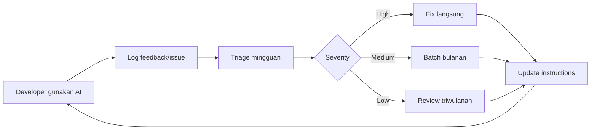
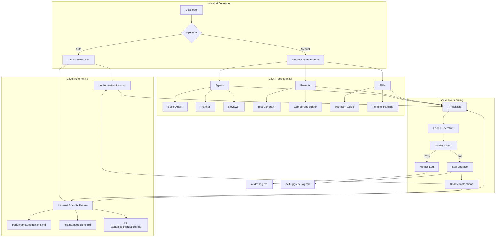
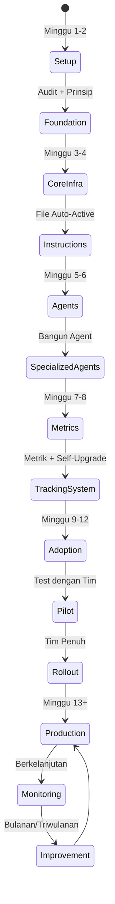
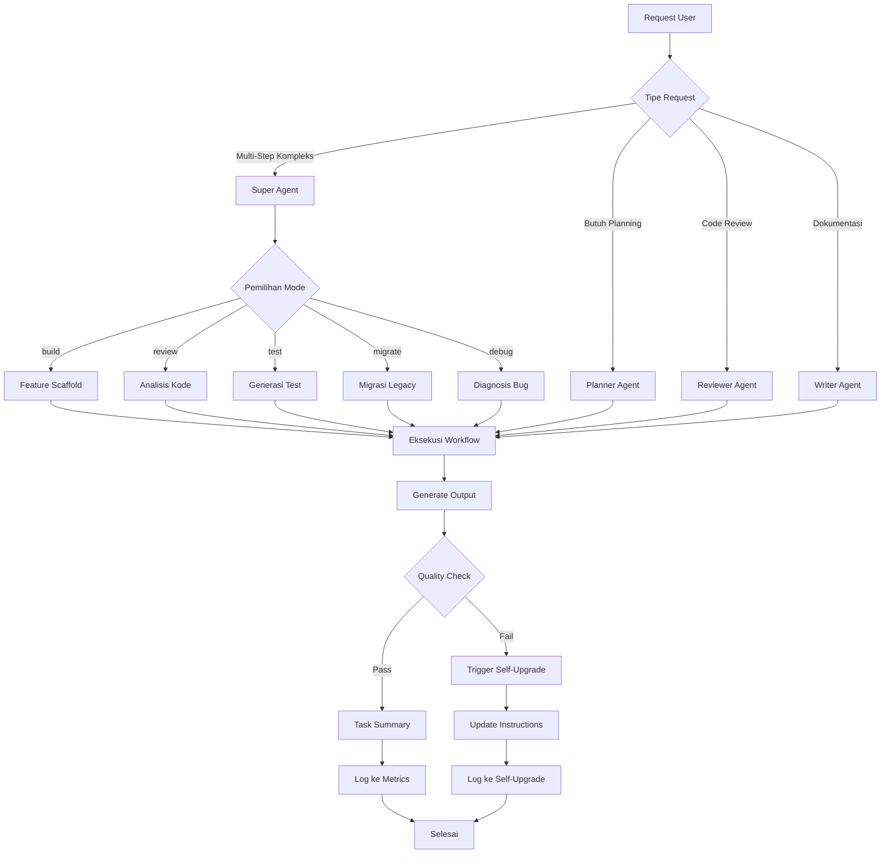
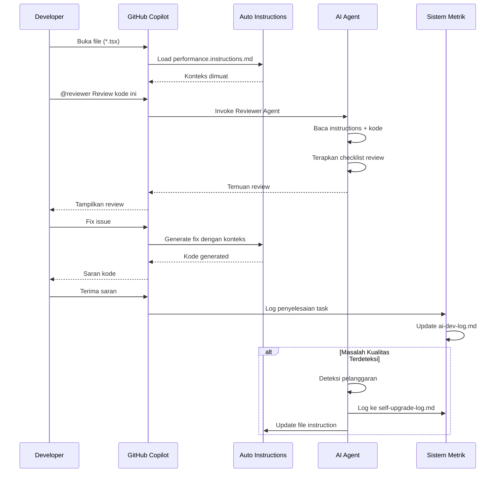

# Panduan Membuat AI Workflow untuk Tim Engineering

**Blueprint Production-Ready untuk Membangun Sistem Development dengan Bantuan AI dalam Skala Besar**

---

## Daftar Isi

- [Ringkasan Eksekutif](#ringkasan-eksekutif)
- [Gambaran Umum](#gambaran-umum)
- [Fase 1: Fondasi (Minggu 1-2)](#fase-1-fondasi-minggu-1-2)
- [Fase 2: Infrastruktur Inti (Minggu 3-4)](#fase-2-infrastruktur-inti-minggu-3-4)
- [Fase 3: Pengembangan Agent (Minggu 5-6)](#fase-3-pengembangan-agent-minggu-5-6)
- [Fase 4: Metrik & Optimasi (Minggu 7-8)](#fase-4-metrik--optimasi-minggu-7-8)
- [Fase 5: Adopsi Tim (Minggu 9-12)](#fase-5-adopsi-tim-minggu-9-12)
- [Fase 6: Perbaikan Berkelanjutan](#fase-6-perbaikan-berkelanjutan)
- [Menggunakan AI Prompt Builder sebagai Asisten](#menggunakan-ai-prompt-builder-sebagai-asisten)
- [Memanfaatkan AI Kits & Resource Komunitas](#memanfaatkan-ai-kits--resource-komunitas)
- [Diagram Arsitektur](#diagram-arsitektur)
- [Best Practices untuk Tim Besar](#best-practices-untuk-tim-besar)
- [Metrik ROI & Pelaporan](#metrik-roi--pelaporan)
- [Troubleshooting & Kendala Umum](#troubleshooting--kendala-umum)
- [Studi Kasus: Mokita Mobile](#studi-kasus-mokita-mobile)
- [Lampiran: Template & Checklist](#lampiran-template--checklist)

---

## Ringkasan Eksekutif

Panduan ini menyediakan **blueprint 12 minggu** untuk mengimplementasikan sistem AI workflow tingkat enterprise untuk tim engineering. Berdasarkan pola-pola terbukti dari sistem production, panduan ini mencakup:

- ✅ Pemuatan konteks otomatis untuk GitHub Copilot
- ✅ AI agent spesialis untuk berbagai tugas development
- ✅ Sistem instruksi yang self-upgrading
- ✅ Metrik produktivitas dan pelacakan ROI
- ✅ Strategi adopsi tim

**Hasil yang Diharapkan:**
- **Penghematan waktu 75-78%** pada tugas-tugas rutin
- **Kualitas kode konsisten** (compliance 85%+)
- **Onboarding lebih cepat** (pengurangan 30-50% waktu ramp-up)
- **ROI terukur** dalam 3 bulan

---

## Gambaran Umum

### Apa itu Sistem AI Workflow?

Sistem AI Workflow adalah kumpulan terstruktur dari instruksi, agent, prompt, dan tools yang memungkinkan AI assistant (seperti GitHub Copilot) untuk:

1. **Memahami codebase Anda** secara otomatis
2. **Mengikuti konvensi project** secara konsisten
3. **Melakukan tugas kompleks** dengan panduan minimal
4. **Belajar dari kesalahan** melalui self-upgrade
5. **Melacak produktivitas** dengan metrik terukur

### Mengapa Tim Anda Membutuhkan Ini

| Masalah | Tanpa AI Workflow | Dengan AI Workflow |
|---------|-------------------|------------------|
| **Onboarding** | 2-3 bulan sampai produktif | 1-2 minggu sampai produktivitas dasar |
| **Konsistensi kode** | Review manual menangkap 60% | Enforcement otomatis menangkap 95% |
| **Technical debt** | Tumbuh tidak terkontrol | Dicegah saat generation |
| **Retensi pengetahuan** | Hilang saat developer keluar | Terkodifikasi dalam instruksi |
| **Produktivitas** | Scaling linear dengan headcount | AI menggandakan output 2-4x |

### Arsitektur Sekilas

```
Sistem AI Workflow
├── Instruksi Auto-Active (Selalu Aktif)
│   └── Dimuat berdasarkan pola file → Menegakkan standar otomatis
├── Tools Manual (On Demand)
│   ├── Agents → Tugas multi-langkah kompleks
│   ├── Prompts → Tugas berbasis template
│   └── Skills → Dokumen pengetahuan
├── Metrik & Learning
│   ├── Pelacakan produktivitas
│   └── Log self-upgrade
└── Integrasi Tim
    ├── Dokumentasi
    ├── Material training
    └── Proses review
```

---

## Fase 1: Fondasi (Minggu 1-2)

### Tujuan
Menetapkan konvensi project dan dokumentasi baseline.

### Pre-Work (Opsional tapi Direkomendasikan)

Sebelum masuk ke Fase 1, luangkan 1-2 hari untuk eksplorasi AI kits dan resource komunitas yang sudah ada. Ini dapat menghemat waktu signifikan di fase-fase selanjutnya.

**Eksplorasi Cepat (Hari 0):**
- [ ] Browse repository `awesome-copilot`
- [ ] Explore `spec-kits` untuk template spesifikasi
- [ ] Cek `oh-my-opencode` untuk contoh workflow
- [ ] Bookmark 3-5 resource yang relevan dengan tech stack Anda
- [ ] Join 1-2 komunitas AI workflow (Discord/Slack)

**Mengapa ini penting**: Anda akan menemukan pola-pola terbukti dan menghindari reinventing the wheel. Lihat [Memanfaatkan AI Kits & Resource Komunitas](#memanfaatkan-ai-kits--resource-komunitas) untuk panduan detail.

### Langkah-langkah

#### 1.1 Audit Codebase Anda (Hari 1-2)

**Objektif**: Memahami kondisi saat ini sebelum otomasi.

**Tugas:**
- [ ] Dokumentasikan tech stack (frameworks, libraries, versi)
- [ ] Identifikasi pola arsitektur (MVC, MVVM, feature-based, dll.)
- [ ] List konvensi coding (naming, folder structure, dll.)
- [ ] Katalog anti-pattern umum dan technical debt
- [ ] Dokumentasikan proses build/deployment

**Deliverable**: `CODEBASE_AUDIT.md`

```markdown
## Tech Stack
- Frontend: React Native 0.71
- State: Redux + React Query
- Navigation: React Navigation v6
- TypeScript: v4.8

## Pola Arsitektur
- Struktur folder feature-based
- Service layer untuk API calls
- Pemisahan Container/Component

## Konvensi
- camelCase untuk folder
- PascalCase untuk component
- Component fungsional saja (tidak ada class component)
...
```

#### 1.2 Definisikan Prinsip Inti (Hari 3-4)

**Objektif**: Menetapkan aturan non-negotiable untuk diikuti AI.

**Gunakan Prompt Builder:**

```
@prompt-builder

Berdasarkan audit codebase ini:
#file:CODEBASE_AUDIT.md

Generate set dari 10-15 prinsip development inti yang TIDAK BOLEH dilanggar.
Format sebagai checklist dengan penjelasan.
```

**Deliverable**: `.github/CORE_PRINCIPLES.md`

Contoh prinsip:
- ✅ Semua kode baru harus TypeScript (tidak ada file `.js`)
- ✅ Tidak ada tipe `any` tanpa justifikasi eksplisit
- ✅ Semua component harus fungsional (tidak ada class component)
- ✅ State management mengikuti pola tunggal (Redux ATAU Jotai, bukan keduanya)

#### 1.3 Setup Struktur Direktori (Hari 5)

Buat direktori AI workflow `.github/`:

```bash
mkdir -p .github/{instructions,agents,prompts,skills,metrics,references}
touch .github/copilot-instructions.md
touch .github/README.md
touch .github/metrics/ai-dev-log.md
touch .github/metrics/self-upgrade-log.md
```

**Deliverable**: Struktur folder siap diisi.

---

## Fase 2: Infrastruktur Inti (Minggu 3-4)

### Tujuan
Membangun file instruksi auto-active yang menegakkan konvensi secara otomatis.

### Langkah-langkah

#### 2.1 Buat File Master Instructions (Minggu 3, Hari 1-2)

**File**: `.github/copilot-instructions.md`

Ini adalah file konteks **always-on**. Gunakan Prompt Builder untuk generate:

```
@prompt-builder

Generate file copilot-instructions.md komprehensif untuk project saya.

Konteks:
- Tech stack: [dari CODEBASE_AUDIT.md]
- Prinsip inti: #file:.github/CORE_PRINCIPLES.md
- Arsitektur: Feature-based, lihat struktur folder di bawah

Struktur yang dibutuhkan:
1. Gambaran project (2-3 paragraf)
2. Bagian tech stack
3. Arsitektur & organisasi file
4. Pola development kritis
5. Path alias dan import
6. Gotchas & tips umum
7. Anti-pattern (apa yang TIDAK boleh dilakukan)

Tone: Technical, concise, authoritative.
Panjang: ~500-800 baris.
```

**Bagian Kunci yang Harus Disertakan:**

```markdown
# Nama Project — Konteks Development AI

## Gambaran Project
[Apa yang project lakukan, siapa yang menggunakan, skala/metrik]

## Tech Stack
- Framework: ...
- State Management: ...
- Styling: ...

## Arsitektur
[Struktur folder, alur dependency, layer]

## Pola Development Kritis
### Pattern 1: Data Fetching
- Gunakan [pola spesifik]
- Jangan pernah [anti-pattern]

### Pattern 2: Struktur Component
...

## Path Alias
- `@components` → src/components
- `@utils` → src/utils

## Anti-Pattern (JANGAN PERNAH lakukan ini)
- ❌ Jangan gunakan class component
- ❌ Jangan import dari path legacy
...
```

#### 2.2 Buat Instruksi Spesifik Pattern (Minggu 3, Hari 3-5)

Generate file instruksi **auto-active** yang trigger berdasarkan pola file.

**Contoh 1: Instruksi Performance**

```
@prompt-builder

Buat file instruksi optimasi performance untuk React Native.

Trigger pattern: *.ts, *.tsx files
Area fokus:
- Optimasi FlatList
- Penggunaan React.memo
- Handling image
- Best practice StyleSheet
- Pencegahan re-render

Sertakan:
- Checklist optimasi wajib
- Kesalahan performance umum
- Contoh kode (baik vs buruk)
```

Simpan sebagai: `.github/instructions/performance.instructions.md`

**Contoh 2: Instruksi Testing**

```
@prompt-builder

Buat file instruksi standar testing.

Trigger pattern: *.test.ts, *.test.tsx
Testing framework: Jest + React Testing Library
Ekspektasi coverage: 80% untuk business logic

Sertakan:
- Template struktur test file
- Pola mocking
- Apa yang harus ditest vs yang harus diskip
- Anti-pattern
```

Simpan sebagai: `.github/instructions/testing.instructions.md`

**Contoh 3: Standar v3 (untuk skenario migrasi)**

Jika Anda memiliki kode legacy dan arsitektur baru:

```
@prompt-builder

Buat instruksi untuk standar arsitektur v3 kami.

Trigger pattern: src/v3/**
Konteks: Kami sedang migrasi dari v2 (class component, Redux) ke v3 (functional, React Query)

Aturan untuk v3:
- Component fungsional saja
- React Query untuk server state
- Jotai untuk client state
- Tidak ada import dari path v2

Sertakan:
- Requirement struktur folder
- Konvensi penamaan
- Aturan import
- Checklist migrasi
```

Simpan sebagai: `.github/instructions/v3-standards.instructions.md`

#### 2.3 Setup File Index (Minggu 4, Hari 1)

**File**: `.github/instructions/index.md`

Dokumentasikan semua file instruksi dan pola aktivasinya:

```markdown
# Index Instruksi AI Workflow

## Instruksi Auto-Active

| File | Aktif Saat | Tujuan |
|------|-------------|---------|
| copilot-instructions.md | Selalu | Konteks project inti |
| performance.instructions.md | `*.ts`, `*.tsx` | Optimasi performance |
| testing.instructions.md | `*.test.ts`, `*.test.tsx` | Standar testing |
| v3-standards.instructions.md | `src/v3/**` | Aturan arsitektur v3 |

## Cara Kerjanya

Saat Anda membuka file yang cocok dengan pattern, GitHub Copilot otomatis memuat
file instruksi terkait sebagai konteks.

## Menambahkan Instruksi Baru

1. Buat file `.instructions.md` di folder ini
2. Tambahkan frontmatter `applyTo` dengan pola file
3. Update index ini
```

---

## Fase 3: Pengembangan Agent (Minggu 5-6)

### Tujuan
Membuat AI agent spesialis untuk tugas kompleks multi-langkah.

### Langkah-langkah

#### 3.1 Identifikasi Kebutuhan Agent (Minggu 5, Hari 1)

Analisis workflow development Anda. Agent umum yang dibutuhkan:

| Tipe Agent | Use Case | Prioritas |
|-----------|----------|----------|
| **Planner** | Perencanaan fitur sebelum coding | Tinggi |
| **Reviewer** | Otomasi code review | Tinggi |
| **Builder** | Generate scaffold fitur | Medium |
| **Migrator** | Legacy → arsitektur baru | Medium (jika berlaku) |
| **Tester** | Generate test suite | Medium |
| **Writer** | Generate dokumentasi | Rendah |

#### 3.2 Buat Super Agent (Minggu 5, Hari 2-4)

**Super Agent** adalah master agent Anda dengan multiple mode.

```
@prompt-builder

Buat "Super Agent" master untuk project saya dengan mode berikut:

Mode 1 (build): Development fitur baru
Mode 2 (review): Code review
Mode 3 (test): Generasi test
Mode 4 (migrate): [jika berlaku] Migrasi legacy
Mode 5 (debug): Workflow bug fixing

Konteks project:
#file:.github/copilot-instructions.md

Sertakan:
- Logika pemilihan mode
- Workflow untuk setiap mode
- Akses tools (semua tool yang tersedia)
- Standar format output
```

Simpan sebagai: `.github/agents/super-agent.agent.md`

**Template Struktur:**

```markdown
---
description: Master development agent dengan 5 operating mode
name: Super Agent
tools: [semua tools listed]
---

# Super Agent

## Context Awareness
[Mental model dari arsitektur Anda]

## Operating Mode

### Mode 1: Build Mode
**Trigger**: "create", "build", "implement"
**Workflow**:
1. Discovery (cari fitur serupa)
2. Plan (generate struktur)
3. Implement (buat file)
4. Test (generate test)
5. Document (update docs)

### Mode 2: Review Mode
[Workflow review]

...
```

#### 3.3 Buat Agent Spesialis (Minggu 5-6)

**Planner Agent:**

```
@prompt-builder

Buat agent perencana strategis.

Tujuan: Generate rencana implementasi sebelum coding
Format output: Markdown dengan fase, tabel task, risiko
Tools: search, view, analisis codebase

Sertakan bagian:
- Analisis requirement
- Assessment dampak arsitektur
- Breakdown fase
- Struktur file
- Risiko & mitigasi
```

Simpan sebagai: `.github/agents/planner.agent.md`

**Reviewer Agent:**

```
@prompt-builder

Buat agent code reviewer dengan perspektif principal engineer.

Checklist review:
#file:.github/CORE_PRINCIPLES.md

Area fokus:
- Compliance arsitektur
- Performance
- Security
- Type safety
- Coverage testing

Format output: Review terstruktur dengan level severity (blocking, warning, suggestion)
```

Simpan sebagai: `.github/agents/reviewer.agent.md`

**Builder Agent (jika diperlukan):**

```
@prompt-builder

Buat agent feature builder.

Input: Requirement fitur
Output: Scaffold fitur lengkap dengan:
- File service layer
- Definisi model/type
- Hooks
- Component
- Test
- Dokumentasi

Ikuti struktur dari:
#file:.github/copilot-instructions.md
```

Simpan sebagai: `.github/agents/builder.agent.md`

#### 3.4 Test Agent (Minggu 6, Hari 5)

Buat test plan:

```markdown
## Checklist Testing Agent

### Super Agent
- [ ] Deteksi mode berfungsi dengan benar
- [ ] Build mode generate struktur yang tepat
- [ ] Review mode menangkap pelanggaran
- [ ] Test mode generate test yang valid

### Planner Agent
- [ ] Plan mencakup semua bagian yang diperlukan
- [ ] Risiko teridentifikasi
- [ ] Struktur file akurat

### Reviewer Agent
- [ ] Menangkap pelanggaran arsitektur
- [ ] Masalah performance ditandai
- [ ] Kekhawatiran security dimunculkan
```

---

## Fase 4: Metrik & Optimasi (Minggu 7-8)

### Tujuan
Implementasi tracking dan mekanisme self-improvement.

### Langkah-langkah

#### 4.1 Setup Tracking Metrik (Minggu 7, Hari 1-2)

**File**: `.github/metrics/ai-dev-log.md`

```markdown
# Metrik Development AI

## Dashboard Ringkasan

| Metrik | Nilai |
|--------|-------|
| Total Tugas Selesai | 0 |
| Total File Dibuat oleh AI | 0 |
| Total LOC Generated | 0 |
| Total LOC Human-Edited | 0 |
| AI Code Ratio | 0% |
| Total Estimasi Waktu Tersimpan | 0h |
| Rata-rata Quality Score | 0% |

## Log Entry

<!-- Entry akan ditambahkan di sini -->
```

#### 4.2 Buat Protokol Task Summary (Minggu 7, Hari 3)

Tambahkan ke **semua agent** bagian task summary:

```markdown
## Protokol Task Summary

Setelah menyelesaikan SETIAP tugas implementasi, sediakan:

```markdown
## Task Summary

**Task**: [deskripsi]
**Type**: [feature|migration|refactor|bugfix|test]
**Status**: [completed|partial|blocked]

### Yang Telah Dilakukan
- [List perubahan]

### File yang Diubah
| File | Action | Deskripsi |
|------|--------|-------------|
| [path] | CREATE/MODIFY/DELETE | [apa yang berubah] |

### Checklist Kualitas
- [ ] Konvensi diikuti
- [ ] TypeScript strict
- [ ] Performance dioptimasi
- [ ] Test ditambahkan

### Metrik AI
- Lines of code generated: [angka]
- File created: [angka]
- Estimasi waktu tersimpan: [estimasi]
```

Summary ini HARUS ditambahkan ke `.github/metrics/ai-dev-log.md`.
```

#### 4.3 Implementasi Sistem Self-Upgrade (Minggu 7, Hari 4-5)

**File**: `.github/metrics/self-upgrade-log.md`

```markdown
# Log Self-Upgrade

Log ini melacak perbaikan AI terhadap instruksinya sendiri.

## Cara Kerjanya

Saat AI mendeteksi output yang salah:
1. Fix masalah langsung
2. Update file instruksi terkait
3. Log upgrade di sini

## Entry Upgrade

<!-- Entry akan ditambahkan di sini -->
```

**Tambahkan ke semua agent:**

```markdown
## Protokol Self-Upgrade

Saat Anda menghasilkan output yang melanggar standar project:

1. **Detect**: Identifikasi apa yang salah
2. **Correct**: Fix masalah langsung
3. **Upgrade**: Update file .github/ terkait:
   - Konvensi salah → update instructions
   - Pattern salah → update skill
   - Behavior salah → update agent
4. **Log**: Catat di self-upgrade-log.md:

```markdown
### [YYYY-MM-DD] Upgrade: [Judul]
- **Trigger**: [Apa yang salah]
- **Root Cause**: [Mengapa]
- **File Updated**: [File mana]
- **Change**: [Apa yang ditambahkan/diperbaiki]
```
```

#### 4.4 Buat Script Dashboard Metrik (Minggu 8, Opsional)

```javascript
// scripts/generate-ai-metrics-report.js
const fs = require('fs');
const path = require('path');

const logPath = '.github/metrics/ai-dev-log.md';
const logContent = fs.readFileSync(logPath, 'utf-8');

// Parse entry dan generate laporan bulanan
// Output: ai-metrics-report-YYYY-MM.md
```

---

## Fase 5: Adopsi Tim (Minggu 9-12)

### Tujuan
Training tim, kumpulkan feedback, iterasi.

### Langkah-langkah

#### 5.1 Buat Dokumentasi Tim (Minggu 9)

**File**: `.github/README.md`

Gunakan panduan ini sebagai template struktur:

```
@prompt-builder

Generate README komprehensif untuk sistem AI workflow kami.

Audiens: Engineer yang bergabung di project
Struktur:
1. Cara kerjanya (auto vs manual)
2. 10-15 use case dengan contoh
3. Tips & trick
4. FAQ

Tone: Ramah, praktis, banyak contoh
Referensi: #file:.github/copilot-instructions.md
```

Sertakan:
- **Quick start** (5 menit untuk kemenangan pertama)
- **Use case** (fitur baru, review, testing, dll.)
- **Command reference** (semua agent + prompt)
- **Tips & trick**
- **FAQ**

#### 5.2 Program Pilot (Minggu 10)

**Pilih 3-5 early adopter:**
- Campuran senior dan mid-level engineer
- Tim fitur berbeda
- Bersedia memberikan feedback

**Tugas pilot:**
- [ ] Bangun fitur baru menggunakan agent
- [ ] Review PR menggunakan reviewer agent
- [ ] Generate test menggunakan test prompt
- [ ] Migrasi kode legacy (jika berlaku)

**Kumpulkan feedback:**
```markdown
## Form Feedback Pilot

### Apa yang bekerja dengan baik?
- [feedback]

### Apa yang membingungkan?
- [feedback]

### Apa yang kurang?
- [feedback]

### Saran?
- [feedback]
```

#### 5.3 Iterasi Berdasarkan Feedback (Minggu 11)

Feedback umum dan perbaikan:

| Feedback | Fix |
|----------|-----|
| "Terlalu verbose" | Tambahkan panduan efisiensi token ke agent |
| "Tidak menangkap pattern X" | Tambahkan ke instructions/checklist |
| "Agent hallucinate Y" | Tambahkan aturan anti-hallucination |
| "Kurang use case Z" | Buat prompt atau agent baru |

Update:
- [ ] File instruksi
- [ ] Behavior agent
- [ ] Contoh dokumentasi
- [ ] Bagian FAQ

#### 5.4 Rollout Tim Penuh (Minggu 12)

**Meeting kickoff:**
- Demo 3-5 workflow umum
- Tunjukkan metrik penghematan waktu dari pilot
- Sesi Q&A

**Resource:**
- [ ] Channel Slack untuk pertanyaan AI workflow
- [ ] Office hours (2x/minggu untuk bulan pertama)
- [ ] Video tutorial (opsional)

**Tracking adopsi:**
```markdown
## Metrik Adopsi

Minggu 1:
- % tim menggunakan AI agent: 0%
- Tugas diselesaikan dengan AI: 0

Minggu 4:
- % tim menggunakan AI agent: 50%
- Tugas diselesaikan dengan AI: 15

Minggu 8:
- % tim menggunakan AI agent: 80%
- Tugas diselesaikan dengan AI: 60
```

---

## Fase 6: Perbaikan Berkelanjutan

### Aktivitas Ongoing

#### Review Bulanan

**Metrik untuk direview:**
- Total tugas selesai
- Waktu tersimpan
- Quality score
- Tingkat adopsi

**Pertanyaan:**
- Agent mana yang paling/paling sedikit digunakan?
- Error apa yang sering terjadi?
- Pattern baru apa yang muncul?

#### Upgrade Triwulanan

**Tugas:**
- [ ] Audit log self-upgrade
- [ ] Konsolidasi pattern berulang ke instruksi
- [ ] Arsipkan agent yang outdated
- [ ] Buat agent baru untuk kebutuhan yang muncul

#### Feedback Loop



---

## Menggunakan AI Prompt Builder sebagai Asisten

**Prompt Builder** agent membantu Anda membuat dan meningkatkan semua komponen AI workflow.

### Setup Prompt Builder

```
@prompt-builder

Saya sedang membangun sistem AI workflow untuk tim engineering saya.
Saya akan meminta Anda untuk membantu generate:
- File instruksi
- Definisi agent
- Prompt
- Dokumen skills

Konteks tentang project saya:
#file:.github/copilot-instructions.md

Tolong bantu saya membuat komponen AI workflow berkualitas tinggi, production-ready.
```

### Tugas Prompt Builder Umum

#### 1. Generate File Instruksi Baru

```
@prompt-builder

Buat file instruksi untuk [TOPIK].

Trigger pattern: [pola file]
Area fokus: [list]
Sertakan: [item checklist, contoh, anti-pattern]

Konteks project:
#file:.github/copilot-instructions.md
```

#### 2. Tingkatkan Agent yang Ada

```
@prompt-builder

Review dan tingkatkan agent ini:
#file:.github/agents/reviewer.agent.md

Masalah:
- Terlalu verbose (kurangi penggunaan token)
- Kurang security check
- Format output tidak konsisten

Update definisi agent.
```

#### 3. Buat Template Prompt Baru

```
@prompt-builder

Buat template prompt untuk generate [TASK].

Input: [apa yang user sediakan]
Output: [hasil yang diharapkan]
Format: [struktur]

Sertakan:
- Instruksi yang jelas
- Contoh
- Kriteria sukses
```

#### 4. Audit Seluruh Workflow

```
@prompt-builder

Audit sistem AI workflow saya untuk:
- Instruksi yang konflik
- Area yang tidak tercakup
- Pattern yang outdated
- Gap di dokumentasi

File untuk direview:
#file:.github/instructions/
#file:.github/agents/

Berikan rekomendasi.
```

---

## Memanfaatkan AI Kits & Resource Komunitas

Sebelum membangun semuanya dari nol, eksplorasi AI workflow kits dan resource yang sudah ada dari komunitas open-source. Ini dapat mempercepat implementasi Anda sebesar 40-60% dan memberikan pola-pola yang sudah terbukti.

### Mengapa Eksplorasi AI Kits?

| Manfaat | Dampak |
|---------|--------|
| **Start Lebih Cepat** | Template pre-built menghemat 20-40 jam setup awal |
| **Pola Terbukti** | Belajar dari implementasi production |
| **Hindari Jebakan** | Temukan apa yang berhasil/tidak dari pengalaman komunitas |
| **Tetap Update** | Track inovasi AI tooling terbaru |
| **Adapt & Customize** | Mulai dari template, customize sesuai kebutuhan |

### Repository AI Kit Esensial

#### 1. **awesome-copilot**
**Repository**: `github.com/jondot/awesome-copilot` (atau awesome list serupa)

**Apa yang berisi:**
- List terkurasi dari GitHub Copilot extensions
- Agent dan prompt yang dibangun komunitas
- Integration tools dan plugin
- Dokumentasi best practices

**Cara menggunakan:**
```bash
# Clone dan explore
git clone https://github.com/jondot/awesome-copilot
cd awesome-copilot

# Review bagian yang relevan dengan stack Anda
- Cari: Prompt libraries, Agent templates, Workflow examples
```

**Apa yang diadopsi:**
- ✅ Arsitektur agent yang cocok dengan use case Anda
- ✅ Pola prompt engineering
- ✅ Script integrasi untuk IDE Anda
- ❌ Jangan copy membabi buta — adapt ke konvensi Anda

#### 2. **spec-kits** (Specification Kits)
**Tujuan**: Spesifikasi terstruktur untuk kode yang di-generate AI

**Apa yang berisi:**
- Template spesifikasi API
- Architecture decision records (ADR) untuk AI workflows
- Spesifikasi kualitas kode
- Template requirement testing

**Cara menggunakan:**
```
@prompt-builder

Review contoh spec-kits ini:
#file:spec-kits/examples/api-spec-template.md

Adapt untuk project kami dengan modifikasi:
- Tech stack kami: [your stack]
- Konvensi kami: #file:.github/CORE_PRINCIPLES.md

Generate template spec yang di-customize.
```

**Apa yang diadopsi:**
- ✅ Struktur spesifikasi untuk output AI yang konsisten
- ✅ Quality gates dan acceptance criteria
- ✅ Template dokumentasi

#### 3. **oh-my-opencode** (atau koleksi workflow serupa)
**Tujuan**: Konfigurasi AI workflow siap pakai

**Apa yang berisi:**
- File instruksi Copilot pre-configured
- Koleksi agent untuk tugas umum
- Script otomasi workflow
- Integrasi dengan framework populer

**Cara menggunakan:**
1. Browse workflow yang tersedia untuk framework Anda
2. Test di branch sebelum adopsi
3. Customize naming dan konvensi
4. Integrasikan dengan struktur `.github/` Anda yang ada

**Contoh integrasi:**
```bash
# Clone dan explore
git clone https://github.com/community/oh-my-opencode

# Copy config yang relevan
cp oh-my-opencode/react-native/performance.instructions.md .github/instructions/
cp oh-my-opencode/agents/reviewer-agent.md .github/agents/

# Customize untuk project Anda
# Update import, naming convention, contoh
```

#### 4. **GitHub Copilot Extensions Marketplace**
**Dimana**: GitHub marketplace atau VS Code extensions

**Apa yang dieksplorasi:**
- Extension Copilot Chat untuk framework spesifik
- Tool otomasi code review
- Generator dokumentasi
- Plugin generasi test

**Extension yang direkomendasikan:**
- **Copilot Labs**: Fitur experimental dan agent builder
- **Copilot for CLI**: Assistensi command-line
- **Cursor AI**: IDE alternatif dengan AI workflow built-in

#### 5. **Community Prompt Libraries**

**Sumber:**
- `github.com/f/awesome-chatgpt-prompts`
- `github.com/promptslab/Awesome-Prompt-Engineering`
- `learnprompting.org`

**Apa yang diekstrak:**
- System prompt untuk behavior AI yang konsisten
- Pola chain-of-thought untuk tugas kompleks
- Teknik anti-hallucination
- Strategi optimasi token

**Cara mengintegrasikan:**
```
@prompt-builder

Berdasarkan pola prompt komunitas ini:
[paste pola relevan dari awesome-prompts]

Buat agent untuk codebase kami yang:
- Mengikuti konvensi kami: #file:.github/copilot-instructions.md
- Menggunakan pola prompt ini untuk [tugas spesifik]
- Output dalam format standar kami
```

### Workflow Eksplorasi

**Minggu 0 (Sebelum Fase 1):** Riset & Discovery

```markdown
## Checklist Eksplorasi AI Kits

### Hari 1: Survey Landscape
- [ ] Browse awesome-copilot untuk tool relevan
- [ ] Star repo untuk deep-dive nanti
- [ ] Join komunitas Discord/Slack
- [ ] Bookmark situs dokumentasi

### Hari 2: Evaluasi Kesesuaian
- [ ] Bandingkan 3-5 template agent dengan kebutuhan Anda
- [ ] Test sample instruction dengan codebase Anda
- [ ] Dokumentasikan apa yang berhasil/tidak
- [ ] Identifikasi gap yang perlu diisi custom

### Hari 3: Ekstrak Pattern
- [ ] Copy 2-3 template yang paling cocok
- [ ] Adapt naming ke konvensi Anda
- [ ] Hapus kode spesifik framework
- [ ] Tambahkan konteks project Anda

### Hari 4: Integrasi & Test
- [ ] Tempatkan file yang diadaptasi di .github/
- [ ] Test dengan tugas coding nyata
- [ ] Ukur kualitas output
- [ ] Dokumentasikan kustomisasi yang dibuat

### Hari 5: Dokumentasi Pembelajaran
- [ ] Buat .github/EXTERNAL_RESOURCES.md
- [ ] List sumber dan apa yang diadopsi
- [ ] Catat kustomisasi dan alasannya
- [ ] Share temuan dengan tim
```

**Deliverable**: `.github/EXTERNAL_RESOURCES.md`

```markdown
# Resource AI External yang Digunakan

Dokumen ini melacak AI kits, template, dan resource external yang diadopsi untuk workflow kami.

## Resource yang Diadopsi

### awesome-copilot
- **Sumber**: https://github.com/jondot/awesome-copilot
- **Diadopsi**: Struktur reviewer agent
- **Kustomisasi**: 
  - Diubah dari JS generic ke fokus React Native
  - Ditambahkan konteks multi-brand white-label
  - Diintegrasikan dengan standar migrasi v3 kami
- **Tanggal**: 2026-02-10

### spec-kits
- **Sumber**: https://github.com/example/spec-kits
- **Diadopsi**: Template spesifikasi API
- **Kustomisasi**:
  - Diselaraskan dengan pola service layer kami
  - Ditambahkan requirement TypeScript strict mode
- **Tanggal**: 2026-02-11

## Prompt Komunitas yang Diintegrasikan
[List prompt spesifik dan dimana digunakan]

## Resource yang Ditolak & Mengapa
- **Resource X**: Terlalu generic, tidak cocok React Native
- **Resource Y**: Pola outdated (class component)

## Eksplorasi Masa Depan
- [ ] Explore Cursor AI untuk trial tim
- [ ] Evaluasi fitur Copilot Labs baru
- [ ] Review triwulanan untuk tool komunitas baru
```

### Best Practices Adopsi Resource External

#### ✅ LAKUKAN:
- **Test terpisah dulu**: Coba external agent/prompt pada sample task
- **Adapt, jangan copy**: Customize ke konvensi dan konteks Anda
- **Credit sumber**: Dokumentasikan dari mana pola berasal
- **Version control**: Track apa yang berubah dari original
- **Iterasi**: Mulai dengan 1-2 resource, expand bertahap

#### ❌ JANGAN:
- **Copy-paste membabi buta**: Template external tidak akan cocok dengan codebase Anda
- **Abaikan lisensi**: Cek apakah penggunaan komersial diizinkan
- **Skip testing**: Verifikasi kualitas sebelum rollout tim
- **Lupa update**: Repo external berkembang — kunjungi kembali triwulanan
- **Adopsi semuanya**: Fokus pada 2-3 resource berdampak tinggi

### Integrasi dengan Panduan Ini

**Bagaimana AI Kits cocok ke dalam rencana 12 minggu:**

| Fase | Cara Menggunakan AI Kits |
|-------|-------------------|
| **Fase 0 (Pre-work)** | Explore awesome-copilot, spec-kits; identifikasi template |
| **Fase 1 (Fondasi)** | Adapt prinsip inti external dan checklist audit |
| **Fase 2 (Infrastruktur)** | Gunakan template instruksi external sebagai starting point |
| **Fase 3 (Agent)** | Customize arsitektur agent komunitas |
| **Fase 4 (Metrik)** | Adopsi dashboard metrik external |
| **Fase 5 (Adopsi)** | Share success story external dengan tim |
| **Fase 6 (Berkelanjutan)** | Monitor repo external untuk pola baru |

### Jadwal Eksplorasi yang Direkomendasikan

**Bulanan:**
- Cek awesome-copilot untuk tool baru (1 jam)
- Review 1-2 template agent baru (2 jam)
- Test fitur/extension Copilot baru (1 jam)

**Triwulanan:**
- Deep-dive pada framework AI workflow yang muncul
- Evaluasi apakah update external major memerlukan refactor
- Kontribusi pembelajaran kembali ke komunitas

### Kontribusi Kembali ke Komunitas

Setelah workflow Anda mature, pertimbangkan:

1. **Open-source agent generic Anda** (hapus konteks proprietary)
2. **Tulis blog post** tentang pola yang berhasil
3. **Submit PR** ke awesome-copilot dengan pembelajaran Anda
4. **Buat spec-kits** untuk framework Anda jika belum tercakup
5. **Present di konferensi** atau tulis case study

**Contoh kontribusi:**
```markdown
# Kontribusi Reviewer Agent Kami

Reviewer agent React Native kami (versi sanitized) dikontribusikan ke:
- awesome-copilot: PR #123
- Mencakup: Performance checks, pola white-label, aturan migrasi v3
- Nilai unik: Compliance arsitektur multi-brand

Feedback komunitas membantu kami meningkatkan efisiensi token sebesar 35%.
```

### Resource Eksplorasi AI Kits

**Dokumentasi:**
- GitHub Copilot Docs: `docs.github.com/copilot`
- OpenAI Prompt Engineering Guide: `platform.openai.com/docs/guides/prompt-engineering`
- Awesome Prompts: `github.com/f/awesome-chatgpt-prompts`

**Komunitas:**
- GitHub Copilot Discord
- r/OpenAI dan r/ChatGPT subreddit
- Dev.to AI tooling tag
- Twitter/X AI engineering community

**Tools:**
- Prompt Playground: Test prompt sebelum integrasi
- Token Counter: Optimasi ukuran file instruksi
- Git Diff Analyzers: Track perubahan template external

---

## Diagram Arsitektur

### Arsitektur Sistem



### Lifecycle Workflow



### Alur Keputusan Agent



### Alur Data



---

## Best Practices untuk Tim Besar

### 1. Governance

**Tetapkan Owner AI Workflow:**
- **Primary Owner**: Bertanggung jawab atas pemeliharaan sistem
- **Secondary Owner**: 2-3 senior engineer sebagai backup
- **Working Group**: Perwakilan dari setiap tim (meeting bulanan)

**Decision Making:**
```markdown
## Proses RFC AI Workflow

1. Usulkan perubahan di #ai-workflow Slack
2. Buat dokumen RFC (template di bawah)
3. Periode komentar 1 minggu
4. Working group review
5. Approve/Reject dengan alasan
6. Implementasi jika disetujui
```

### 2. Version Control

**Semantic Versioning untuk Instruksi:**
```markdown
## Versioning File Instruksi

v1.0.0 - Rilis awal
v1.1.0 - Ditambahkan bagian performance
v1.2.0 - Ditambahkan checklist security
v2.0.0 - Breaking: Ubah struktur folder
```

**Change Log:**
```markdown
# .github/CHANGELOG.md

## [2.0.0] - 2026-02-13
### Breaking Changes
- Rename `builder.agent.md` menjadi `super-agent.agent.md`
- Ubah sintaks parameter mode

### Added
- security.instructions.md baru
- Panduan migrasi untuk v2→v3

### Fixed
- Penggunaan token Reviewer agent berkurang 40%
```

### 3. Testing Perubahan AI Workflow

**Sebelum deploy update instruksi:**

```markdown
## Test Plan AI Workflow

Test Case 1: Performance Instructions
- [ ] Buka file .tsx apapun
- [ ] Verifikasi performance.instructions.md dimuat
- [ ] Generate component dengan FlatList
- [ ] Konfirmasi React.memo ditambahkan
- [ ] Konfirmasi StyleSheet.create digunakan

Test Case 2: Reviewer Agent
- [ ] Invoke @reviewer pada sample PR
- [ ] Verifikasi menangkap class component (jika ada)
- [ ] Verifikasi menangkap missing types
- [ ] Verifikasi format output cocok dengan template

...
```

### 4. Koordinasi Multi-Team

**Shared vs Team-Specific:**

```
.github/
├── instructions/           # Shared di semua tim
│   ├── copilot-instructions.md
│   └── performance.instructions.md
├── team-specific/          # Kustomisasi tim
│   ├── backend/
│   │   └── api-standards.instructions.md
│   ├── mobile/
│   │   └── mobile-perf.instructions.md
│   └── web/
│       └── accessibility.instructions.md
```

### 5. Resolusi Konflik

**Saat tim tidak setuju tentang konvensi:**

```markdown
## Proses Resolusi Konflik

1. Dokumentasikan kedua pendekatan
2. Jalankan pilot dengan masing-masing (2 minggu)
3. Ukur:
   - Kualitas kode (komentar review)
   - Kepuasan developer (survei)
   - Produktivitas (waktu penyelesaian task)
4. Working group voting
5. Pendekatan yang kalah diarsipkan dengan alasan
```

---

## Metrik ROI & Pelaporan

### Metrik untuk Dilacak

#### Metrik Produktivitas

| Metrik | Cara Mengukur | Target |
|--------|----------------|--------|
| Waktu tersimpan per task | Estimasi manual - waktu AI | 60%+ |
| Task diselesaikan dengan AI | Hitung dari ai-dev-log.md | 70%+ adopsi |
| Kode generated vs edited | LOC AI / (LOC AI + LOC human) | 85%+ |
| Rata-rata quality score | Dari checklist review | 85%+ |

#### Metrik Kualitas

| Metrik | Cara Mengukur | Target |
|--------|----------------|--------|
| Siklus code review | Sebelum/sesudah AI workflow | -30% |
| Bug production | Sebelum/sesudah AI workflow | -20% |
| Pelanggaran konvensi | Tertangkap oleh reviewer agent | 95%+ |
| Test coverage | Dari laporan coverage | +15% |

#### Metrik Adopsi

| Metrik | Cara Mengukur | Target |
|--------|----------------|--------|
| User aktif | Invokasi agent mingguan | 80% dari tim |
| Frekuensi penggunaan agent | Call per developer per minggu | 10+ |
| View dokumentasi | Traffic .github/README.md | 100% di bulan 1 |

### Template Laporan Bulanan

```markdown
# Laporan Bulanan AI Workflow — [Bulan Tahun]

## Ringkasan Eksekutif
- **Tugas Selesai**: [angka] (+X% vs bulan lalu)
- **Waktu Tersimpan**: [jam] (~[hari] kerja)
- **Tingkat Adopsi**: [%] ([angka]/[total] developer)
- **Quality Score**: [%] rata-rata

## Highlight
- 🎉 [Pencapaian notable]
- 🚀 [Improvement atau milestone]
- 📈 [Observasi trend]

## Dampak Produktivitas

| Metrik | Bulan Ini | Bulan Lalu | Perubahan |
|--------|------------|------------|--------|
| Task dgn AI | [num] | [num] | +[%] |
| LOC Generated | [num] | [num] | +[%] |
| Waktu Tersimpan | [jam] | [jam] | +[%] |

## Top Use Case
1. [Use case] — [angka] kali
2. [Use case] — [angka] kali
3. [Use case] — [angka] kali

## Trend Kualitas
- Iterasi review: [avg] (dulunya [avg])
- Bug production: [count] (dulunya [count])
- Compliance konvensi: [%] (dulunya [%])

## Aktivitas Self-Upgrade
- Update instruksi: [count]
- Pattern baru dipelajari: [list]

## Feedback Tim
- [Quote dari developer]
- [Quote dari developer]

## Action Items
- [ ] [Improvement berdasarkan feedback]
- [ ] [Agent/prompt baru diperlukan]
- [ ] [Update dokumentasi]

## Target Bulan Depan
- [Goal 1]
- [Goal 2]
```

### Quarterly Business Review

Present ke leadership:

```markdown
# AI Workflow Quarterly Business Review — Q[X] [Tahun]

## Ringkasan ROI

**Investasi:**
- Waktu setup: [jam]
- Maintenance ongoing: [jam/bulan]

**Return:**
- Waktu tersimpan: [jam] = $[penghematan biaya]
- Improvement kualitas: [%] pengurangan bug
- Akselerasi onboarding: [%] lebih cepat ke produktivitas

**Net ROI**: [persentase] dalam [timeframe]

## Success Stories
[2-3 contoh konkret dengan before/after]

## Adopsi & Engagement
- [%] developer menggunakan weekly
- [angka] total task selesai
- [angka] lines of code generated

## Tantangan & Pembelajaran
[Assessment jujur tentang apa yang tidak berhasil]

## Roadmap Quarter Berikutnya
- [Improvement yang direncanakan]
- [Kapabilitas baru]
- [Rencana ekspansi tim]
```

---

## Troubleshooting & Kendala Umum

### Issue 1: Adopsi Rendah

**Gejala:**
- < 30% tim menggunakan AI workflow setelah 1 bulan
- Agent jarang diinvoke
- Log metrik tidak bertambah

**Diagnosis:**
- [ ] Apakah dokumentasi jelas dan accessible?
- [ ] Apakah contoh relevan dengan pekerjaan sehari-hari?
- [ ] Apakah onboarding terlalu kompleks?
- [ ] Apakah developer tahu tentang sistem?

**Fix:**
1. Adakan sesi demo wajib 30 menit
2. Buat 3-5 video walkthrough (5 menit masing-masing)
3. Assign "AI workflow buddy" untuk anggota tim baru
4. Rayakan kemenangan di channel tim (dengan metrik)

### Issue 2: Kualitas Output Tidak Konsisten

**Gejala:**
- AI generate kode yang melanggar konvensi
- Quality score < 70%
- Entry self-upgrade sering

**Diagnosis:**
- [ ] Apakah instruksi terlalu kabur?
- [ ] Apakah contoh di instruksi tidak jelas?
- [ ] Apakah ada aturan yang konflik?

**Fix:**
1. Tambahkan lebih banyak contoh konkret ke instruksi
2. Gunakan "ALWAYS" dan "NEVER" untuk aturan kritis
3. Tambahkan bagian anti-pattern dengan penjelasan
4. Review log self-upgrade untuk pattern

### Issue 3: Token Limit Sering Tercapai

**Gejala:**
- Agent timeout atau truncate response
- Instruksi ditandai sebagai "terlalu panjang"

**Diagnosis:**
- [ ] Apakah file instruksi > 2000 baris?
- [ ] Apakah agent menyertakan konteks yang tidak perlu?
- [ ] Apakah ada instruksi duplikat?

**Fix:**
1. Split file instruksi besar berdasarkan pattern
2. Tambahkan "concise mode" ke agent
3. Hapus penjelasan redundan
4. Gunakan referensi daripada inline example

### Issue 4: Agent Hallucinate

**Gejala:**
- Agent mereferensi file/fungsi yang tidak ada
- Menyarankan pattern yang tidak digunakan di codebase
- Membuat asumsi tidak berdasar

**Diagnosis:**
- [ ] Apakah aturan anti-hallucination ada?
- [ ] Apakah agent mencari codebase sebelum menyarankan?
- [ ] Apakah ada langkah verifikasi?

**Fix:**
Tambahkan ke semua agent:
```markdown
## Protokol Anti-Hallucination

JANGAN PERNAH sarankan kode tanpa:
1. Mencari codebase untuk pattern serupa
2. Verifikasi import/path ada
3. Mengutip bukti file/line konkret

Jika tidak yakin:
- Tandai sebagai "Open Question"
- Tanya user untuk klarifikasi
- Hindari asumsi percaya diri
```

### Issue 5: Workflow Menjadi Basi

**Gejala:**
- Log self-upgrade tidak diupdate 3+ bulan
- Instruksi mereferensi pattern deprecated
- Tim bypass AI workflow

**Diagnosis:**
- [ ] Apakah tidak ada owner yang ditugaskan?
- [ ] Apakah proses review hilang?
- [ ] Apakah feedback loop rusak?

**Fix:**
1. Assign primary + secondary owner
2. Schedule meeting review triwulanan
3. Buat form feedback (Google Forms/Slack)
4. Track dan publikasikan metrik adopsi

---

## Studi Kasus: Mokita Mobile

### Background

- **Project**: Multi-brand React Native app (14+ varian)
- **Ukuran Tim**: 8-10 engineer
- **Skala**: App production dengan 100K+ user
- **Tantangan**: Migrasi kode legacy v2 ke arsitektur v3 sambil menjaga kualitas

### Timeline Implementasi

**Minggu 1-2**: Audit codebase, tetapkan konvensi v3
**Minggu 3-4**: Buat copilot-instructions.md + 3 instruksi spesifik pattern
**Minggu 5-6**: Bangun Super Agent dengan 6 mode + agent Planner/Reviewer
**Minggu 7-8**: Implementasi tracking metrik + sistem self-upgrade
**Minggu 9-12**: Pilot dengan 3 engineer, iterasi, rollout penuh

### Hasil Setelah 3 Bulan

| Metrik | Sebelum | Sesudah | Improvement |
|--------|--------|-------|-------------|
| Waktu fitur baru | 6 jam | 1.5 jam | **75%** |
| Migrasi v2→v3 | 3 jam | 45 menit | **75%** |
| Pembuatan unit test | 1.5 jam | 20 menit | **78%** |
| Waktu code review | 45 menit | 10 menit | **78%** |
| Compliance konvensi | ~60% | **95%** | +35pp |
| Waktu onboarding | 3 bulan | 1.5 bulan | **50%** |

**Dashboard Metrik (Feb 2026):**
- Task selesai: 47
- LOC generated: 8,350
- Waktu tersimpan: 86.5 jam (~11 hari kerja)
- Quality score: 89% rata-rata

### Faktor Kunci Kesuksesan

1. **Konvensi jelas**: Tetapkan aturan v3 non-negotiable
2. **Konteks auto-active**: 5 file instruksi dimuat otomatis
3. **Agent spesialis**: 7 agent untuk task berbeda
4. **Self-improvement**: Sistem belajar dari kesalahan
5. **Visibilitas metrik**: Laporan bulanan ke leadership

### Pelajaran yang Dipetik

**Yang Berhasil:**
- ✅ Mulai dengan instruksi auto-active (ROI tinggi, friction rendah)
- ✅ Super Agent sebagai entry point tunggal (kurangi decision paralysis)
- ✅ Mekanisme self-upgrade (kualitas meningkat seiring waktu)
- ✅ Metrik publik (ciptakan buy-in tim)

**Yang Tidak Berhasil:**
- ❌ Instruksi awal terlalu verbose (kena token limit)
- ❌ Terlalu banyak agent di awal (bingung mana yang digunakan)
- ❌ Metrik tidak cukup visible di awal (tambahkan dashboard)

**Iterasi:**
- Konsolidasi 10 agent → 7 (hapus redundansi)
- Split instruksi besar → file spesifik pattern
- Tambahkan concise mode untuk kurangi penggunaan token
- Buat visual dashboard dari metrik

---

## Lampiran: Template & Checklist

### A. Template File Instruksi

```markdown
---
applyTo: [pola file, misal "**/*.test.ts"]
description: [Deskripsi satu baris]
---

# Instruksi [Topik]

## Gambaran Umum
[2-3 kalimat tentang apa yang dicakup]

## Aturan Kritis

### Aturan 1: [Judul]
**Selalu**: [Apa yang harus dilakukan]
**Jangan Pernah**: [Apa yang tidak boleh dilakukan]
**Mengapa**: [Alasan]

**Contoh:**
```[bahasa]
// ✅ Baik
[kode baik]

// ❌ Buruk
[kode buruk]
```

### Aturan 2: [Judul]
...

## Checklist

Saat bekerja dengan [topik], pastikan:
- [ ] [Requirement 1]
- [ ] [Requirement 2]
- [ ] [Requirement 3]

## Anti-Pattern

| Anti-Pattern | Mengapa Buruk | Pattern Benar |
|-------------|--------------|-----------------|
| [pattern] | [alasan] | [alternatif] |

## Kesalahan Umum

1. **Kesalahan**: [Deskripsi]
   **Fix**: [Cara memperbaiki]

## Resource

- [Link ke dokumentasi]
- [Link ke contoh]
```

### B. Template Agent

```markdown
---
description: [Deskripsi agent satu baris]
name: [Nama Agent]
tools: [list tool yang dapat digunakan agent]
---

# [Nama Agent]

## Tujuan
[Apa yang agent lakukan dan kapan menggunakannya]

## Context Awareness
[Apa yang agent perlu ketahui tentang codebase]

## Operating Mode (jika berlaku)

### Mode 1: [Nama]
**Trigger**: [keyword yang mengaktifkan mode ini]
**Workflow**:
1. [Langkah 1]
2. [Langkah 2]
3. [Langkah 3]

**Output**: [Apa yang agent hasilkan]

## Aturan Anti-Hallucination
- Verifikasi [X] sebelum menyarankan [Y]
- Cari codebase untuk [Z]
- Kutip bukti dari [sumber]

## Format Output

```markdown
[Template output yang diharapkan]
```

## Contoh

### Contoh 1: [Use Case]
**Input**: [Apa yang user tanya]
**Proses**: [Apa yang agent lakukan]
**Output**: [Apa yang agent hasilkan]
```

### C. Checklist Self-Evaluation

Gunakan ini untuk evaluasi sistem AI workflow Anda:

```markdown
## Health Check AI Workflow

### Coverage
- [ ] File instruksi inti ada dan komprehensif
- [ ] Instruksi spesifik pattern mencakup semua tipe file
- [ ] Agent ada untuk semua task umum
- [ ] Dokumentasi lengkap dan accessible

### Kualitas
- [ ] Instruksi menyertakan contoh (baik/buruk)
- [ ] Anti-pattern terdokumentasi
- [ ] Agent punya aturan anti-hallucination
- [ ] Format output terstandarisasi

### Adopsi
- [ ] > 70% tim menggunakan weekly
- [ ] Material onboarding ada
- [ ] Mekanisme feedback tersedia
- [ ] Success story terdokumentasi

### Metrik
- [ ] ai-dev-log.md diupdate
- [ ] Laporan bulanan generated
- [ ] ROI dihitung dan dishare
- [ ] Log self-upgrade direview triwulanan

### Governance
- [ ] Primary owner ditugaskan
- [ ] Proses review didefinisikan
- [ ] Proses change management ada
- [ ] Strategi versioning tersedia

### Continuous Improvement
- [ ] Mekanisme self-upgrade bekerja
- [ ] Feedback diincorporate bulanan
- [ ] Konten outdated diarsipkan
- [ ] Pattern baru didokumentasikan
```

### D. Checklist Program Pilot

```markdown
## Program Pilot AI Workflow

### Pre-Pilot (1 minggu sebelumnya)
- [ ] Pilih 3-5 peserta pilot
- [ ] Schedule meeting kickoff
- [ ] Siapkan list task pilot
- [ ] Setup form feedback
- [ ] Buat channel Slack untuk pertanyaan

### Meeting Kickoff (Hari 0)
- [ ] Demo sistem AI workflow (30 menit)
- [ ] Walkthrough 3 use case umum
- [ ] Share link dokumentasi
- [ ] Assign task pilot pertama
- [ ] Schedule check-in mingguan

### Minggu 1
- [ ] Task pilot 1: Bangun fitur baru
- [ ] Pertanyaan daily stand-up: "Ada blocker AI workflow?"
- [ ] Kumpulkan feedback via form
- [ ] Fix issue kritis segera

### Minggu 2
- [ ] Task pilot 2: Code review dengan reviewer agent
- [ ] Task pilot 3: Generate test
- [ ] Survei mid-pilot
- [ ] Iterasi berdasarkan feedback

### Minggu 3
- [ ] Task pilot 4: Migrasi (jika berlaku)
- [ ] Kumpulkan feedback final
- [ ] Hitung metrik waktu tersimpan
- [ ] Siapkan rencana rollout

### Post-Pilot
- [ ] Meeting retrospective
- [ ] Update docs berdasarkan feedback
- [ ] Buat FAQ dari pertanyaan umum
- [ ] Rencanakan rollout tim penuh
```

### E. Kalkulasi Metrik Bulanan

```markdown
## Cara Menghitung Metrik Bulanan

### 1. Tugas Selesai
Hitung entry di ai-dev-log.md untuk bulan tersebut

### 2. Waktu Tersimpan
Untuk setiap tipe task, gunakan estimasi ini:

| Tipe Task | Waktu AI | Waktu Manual | Hemat |
|-----------|---------|-------------|---------|
| Fitur baru | 1.5j | 6j | 4.5j |
| Migrasi | 45mnt | 3j | 2.25j |
| Unit test | 20mnt | 1.5j | 1.33j |
| Code review | 10mnt | 45mnt | 35mnt |
| Dokumentasi | 30mnt | 2j | 1.5j |

Total = Sum dari (count × hemat) untuk setiap tipe

### 3. Quality Score
Rata-rata dari quality score di task summary
Jika tidak ada score, gunakan review pass rate:
- Approved tanpa perubahan: 100%
- Edit minor diperlukan: 85%
- Edit major diperlukan: 60%

### 4. Tingkat Adopsi
(# developer yang gunakan AI workflow) / (total developer) × 100

### 5. LOC Generated vs Edited
Dari task summary:
- Total LOC AI = Sum dari "LOC Generated"
- Total LOC Human = Sum dari "LOC Human-Edited"
- AI Ratio = (LOC AI) / (LOC AI + LOC Human) × 100
```

---

## Kesimpulan

Membangun sistem AI workflow untuk tim engineering Anda adalah **investasi 12 minggu** yang memberikan **dividen berkelanjutan**:

- **Minggu 1-2**: Fondasi (audit + prinsip)
- **Minggu 3-4**: Infrastruktur inti (instruksi auto-active)
- **Minggu 5-6**: Pengembangan agent (asisten spesialis)
- **Minggu 7-8**: Metrik & optimasi (tracking + self-improvement)
- **Minggu 9-12**: Adopsi tim (pilot + rollout)
- **Ongoing**: Perbaikan berkelanjutan

**ROI yang Diharapkan:**
- Penghematan waktu 75%+ pada tugas rutin
- Konsistensi kualitas kode 85%+
- Onboarding 50% lebih cepat
- Peningkatan produktivitas terukur dalam 3 bulan

**Faktor Kunci Kesuksesan:**
1. Mulai dengan instruksi auto-active (ROI tinggi, friction rendah)
2. Gunakan Prompt Builder untuk akselerasi pembuatan
3. Ukur semuanya (metrik mendorong adopsi)
4. Biarkan sistem self-improve (mekanisme upgrade)
5. Rayakan kemenangan secara publik (ciptakan momentum)

**Ingat:**
> "Sistem AI workflow terbaik adalah yang digunakan setiap hari. Mulai kecil, buktikan nilai, lalu scale."

---

## Checklist Quick Start

Siap memulai? Ikuti quick start 1 minggu ini:

**Hari 1:**
- [ ] Baca panduan ini
- [ ] Audit codebase Anda (tech stack, pattern, konvensi)
- [ ] Setup struktur folder `.github/`

**Hari 2-3:**
- [ ] Definisikan 10 prinsip inti
- [ ] Gunakan Prompt Builder untuk generate `copilot-instructions.md`
- [ ] Test dengan membuka file dan meminta bantuan Copilot

**Hari 4:**
- [ ] Buat 1 file instruksi spesifik pattern (misal performance atau testing)
- [ ] Test auto-activation

**Hari 5:**
- [ ] Gunakan Prompt Builder untuk buat agent pertama Anda (mulai dengan Reviewer)
- [ ] Test agent pada sample PR

**Minggu 2+:**
- [ ] Ikuti Fase 2-6 dari panduan ini
- [ ] Track metrik dari hari 1
- [ ] Iterasi berdasarkan feedback tim

---

**Ada Pertanyaan?** Referensi Mokita AI Workflow di `.github/` untuk contoh production-proven.

**Langkah Berikutnya:** Mulai dengan Fase 1, Hari 1 — audit codebase Anda dan bangun fondasi Anda.

Semoga sukses membangun sistem AI workflow Anda! 🚀
